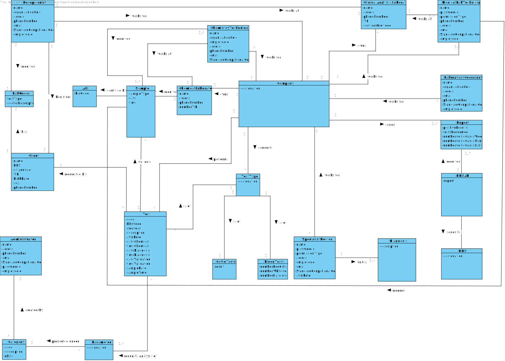

# OO Analysis #

The construction process of the domain model is based on the client specifications, especially the nouns (for _concepts_) and verbs (for _relations_) used. 

## Rationale to identify domain conceptual classes ##
To identify domain conceptual classes, start by making a list of candidate conceptual classes inspired by the list of categories suggested in the book "Applying UML and Patterns: An Introduction to Object-Oriented Analysis and Design and Iterative Development". 

### _Conceptual Class Category List_ ###

| **Category** 		|  **Candidate Classes** |
|------------  				|---------      |
| **Business Transactions** 	| Test, Blood Tests, Covid Tests|
|**Transaction Line Items**| Sample|
|**Product/Service related to a Transaction or Transaction Line Item**| Parameter  |
|**Transaction Records**|  Report|
|**Roles of People or Organizations**|External Doctor, Client, Receptionist, Medical Lab Technicians, Chemistry Technologist, Specialist Doctor, Laboratory Coordinator, Adminstrator|
|**Places**|Clinical Analysis Laboratory, Chemical Laboratory, Company's Headquarters|
|**Noteworthy Events**|Chemical Analysis, Diagnosis, Automatic Validation, Notification|
|**Physical Objects**| Lab Order|
|**Descriptions of Things**| Type of Test, Category|
|**Catalogs**||
|**Containers**||
|**Elements of Containers**| |
|**Organizations**|Company, NHS|
|**Other External/Collaborating Systems**| External Module,External API, NHS API, Application|
|**Records of finance, work, contracts, legal matters**|Chemical Analysis, Diagnosis, Covid-19 Report, Report, barcode|
|**Financial Instruments**||
|**Documents mentioned/used to perform some work**| Lab Order, Reports|

### **Rationale to identify associations between conceptual classes**

An association is a relationship between instances of objects that indicates a relevant connection and that is worth of remembering, or it is derivable from the List of Common Associations: 

+ **_A_** is physically or logically part of **_B_**
+ **_A_** is physically or logically contained in/on **_B_**
+ **_A_** is a description for **_B_**
+ **_A_** known/logged/recorded/reported/captured in **_B_**
+ **_A_** uses or manages or owns **_B_**
+ **_A_** is related with a transaction (item) of **_B_**
+ etc.

| Concept (A) 		|  Association   	|  Concept (B) |
|----------	   		|:-------------:		|------:       |
|Administrator|Creates|Category|
|Administrator|access|Application|
|Automatic Validation|done by |External Module|
|Blood Test| is of| Test
|Chemical Analysis|results in|Results|
|Chemical Laboratory 	| receives | Sample|
|Chemistry Technologist | receives | Sample
|Chemistry Technologist | works at | Chemical Laboratory
|Chemistry Technologist | works for| Company
|Client|requests |Test|
|Client| has | Lab Order|
|Clinical Analysis Laboratory 	| performs | Test|
|Company 	| performs| Tests|
|Company | conducts | TestType|
|Company | owns | Chemical Laboratory|
|Company| owns | Clinical Analysis Laboratory|
|Company| owns | Company's Headquarters|
|Covid-19 Test| is of | Test
|Laboratory Coordinator | works for | Company
|Laboratory Coordinator |access|Application|
|MLT | identifies | Sample
|MLT | works at | Clinical Analysis Laboratory|
|MLT | works for | Company
|NHS API | sends to | NHS
|Parameter 	| presented under  | Category  |
|Receptionist | receives | Lab Order
|Receptionist | registers | Client
|Receptionist | works at | Clinical Analysis Laboratory|
|Receptionist | works for | Company
|Sample|associates with|Test|
|Sample|identified by|API|
|Specialist Doctor | works for| Company|
|Specialist Doctor | writes | Diagnosis|
|Test | is of | TestType
|Test | requested by | Client
|Test | requests analysis of | Parameter|
|Test|collects|Sample|
|Test|performed at|Clinical Analysis Laboratory|
|Test|results in|Sample|

## Domain Model

**Do NOT forget to identify concepts atributes too.**

**Insert below the Domain Model Diagram in a SVG format**

