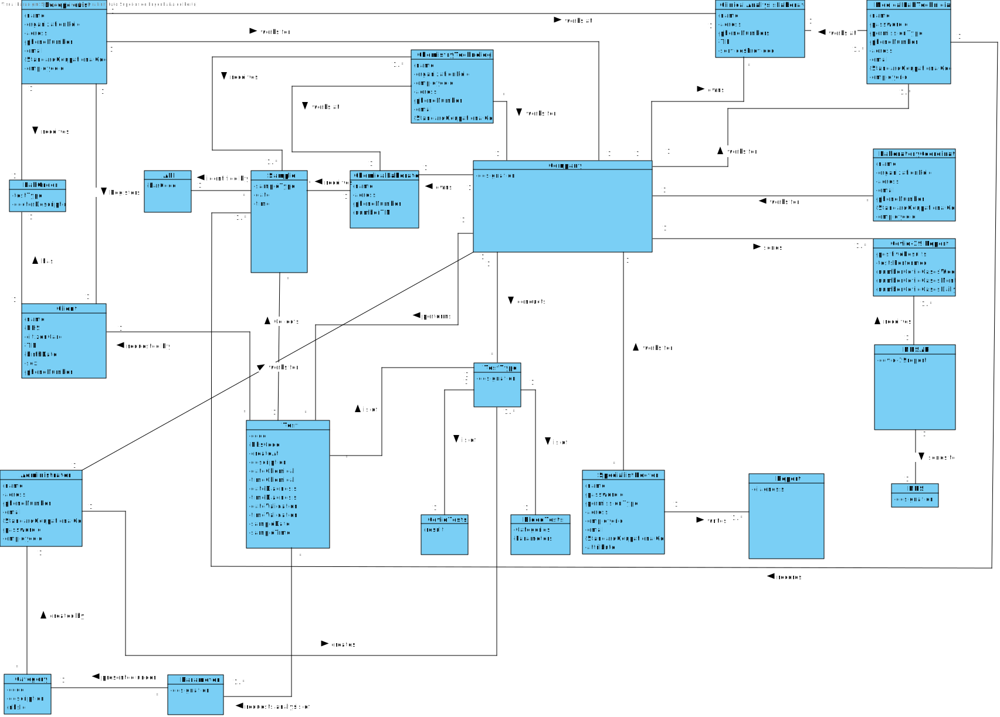

# OO Analysis #

The construction process of the domain model is based on the client specifications, especially the nouns (for _concepts_) and verbs (for _relations_) used. 

## Rationale to identify domain conceptual classes ##
To identify domain conceptual classes, start by making a list of candidate conceptual classes inspired by the list of categories suggested in the book "Applying UML and Patterns: An Introduction to Object-Oriented Analysis and Design and Iterative Development". 

### _Conceptual Class Category List_ ###

| **Category** 		|  **Candidate Classes** |
|------------  				|---------      |
| **Business Transactions** 	| Test, Blood Tests, Covid Tests|
|**Transaction Line Items**| Sample|
|**Product/Service related to a Transaction or Transaction Line Item**| Parameter  |
|**Transaction Records**|  Report|
|**Roles of People or Organizations**|External Doctor, Client, Receptionist, Medical Lab Technicians, Chemistry Technologist, Specialist Doctor, Laboratory Coordinator, Adminstrator|
|**Places**|Clinical Analysis Laboratory, Chemical Laboratory, Company's Headquarters|
|**Noteworthy Events**|Chemical Analysis, Diagnosis, Automatic Validation, Notification|
|**Physical Objects**| Lab Order|
|**Descriptions of Things**| Type of Test, Category|
|**Organizations**|Company, NHS|
|**Other External/Collaborating Systems**| External Module,External API, NHS API, Application|
|**Records of finance, work, contracts, legal matters**|Chemical Analysis, Diagnosis, Covid-19 Report, Report, barcode, Results|
|**Documents mentioned/used to perform some work**| Lab Order, Reports|

### **Rationale to identify associations between conceptual classes**

| Concept (A) 		|  Association   	|  Concept (B) |
|----------	   		|:-------------:		|------:       |
|Administrator|creates|Category|
|Admnistrator| creates| Test Type|
| API |identifies | Sample|
|Blood Test| is of| Test|
|Category| presents | Parameter
|Category| created by| Administrator|
|Chemical Laboratory 	| receives | Sample|
|Chemical Laboratory| has | Chemistry Techologist|
|Chemical Laboratory| is owned by| Company|
|Chemistry Technologist | receives | Sample
|Chemistry Technologist | works at | Chemical Laboratory
|Chemistry Technologist | works for| Company
|Client|requests |Test|
|Client| has | Lab Order|
|Client | registered by | Recepcionist|
|Clinical Analysis Laboratory 	| performs | Test|
|Clinical Analysis Laboratory | has | Recepcionist|
|Clinical Analysis Laboratory | has | MLT |
|Clinical Analysis Laboratory| is owned by| Company|
|Company 	| performs| Test|
|Company | conducts | TestType|
|Company | owns | Chemical Laboratory|
|Company| owns | Clinical Analysis Laboratory|
|Company| owns | Company's Headquarters|
|Company | has | Specialist Doctor|
|Company| has | Recepcionist|
|Company | has | Chemistry Technologist|
|Company's Headquarters| is owned by| Company|
|Company | has | MLT
|Covid-19 Test| is of | Test|
| Diagnosis | is written by | Specialist Doctor|
|Laboratory Coordinator | works for | Company
|Laboratory Coordinator |access|Application|
| Lab Order| is received by | Receptionist
|Lab Order| is owned by | Client|
|MLT | identifies | Sample
|MLT | works at | Clinical Analysis Laboratory|
|MLT | works for | Company|
|NHS | receives | NHS API|
|NHS API | sends to | NHS
|Parameter 	| presented under  | Category  |
|Parameter | is requested analysis by | Test|
|Receptionist | receives | Lab Order
|Receptionist | registers | Client
|Receptionist | works at | Clinical Analysis Laboratory|
|Receptionist | works for | Company
|Sample|associates with|Test|
|Sample|identified by|API|
| Sample| received by| Chemistry Technologist|
| Sample | identified by | MLT|
|Sample |  identified by| API|
|Specialist Doctor | works for| Company|
|Specialist Doctor | writes | Diagnosis|
|Test| is associated with | Sample|
|Test | is of | TestType
|Test | requested by | Client
|Test | requests analysis of | Parameter|
|Test|collects|Sample|
|Test|performed at|Clinical Analysis Laboratory|
|Test|results in|Sample|
|Test| is performed by| Company|
| Test| has | Blood Test|
|Test| has | Covid-19 Test|
|Test Type | has | Test|
|Test Type | created by | Administrator|

## Domain Model

**Do NOT forget to identify concepts atributes too.**

**Insert below the Domain Model Diagram in a SVG format**

