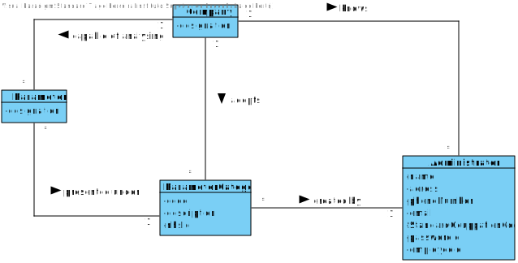
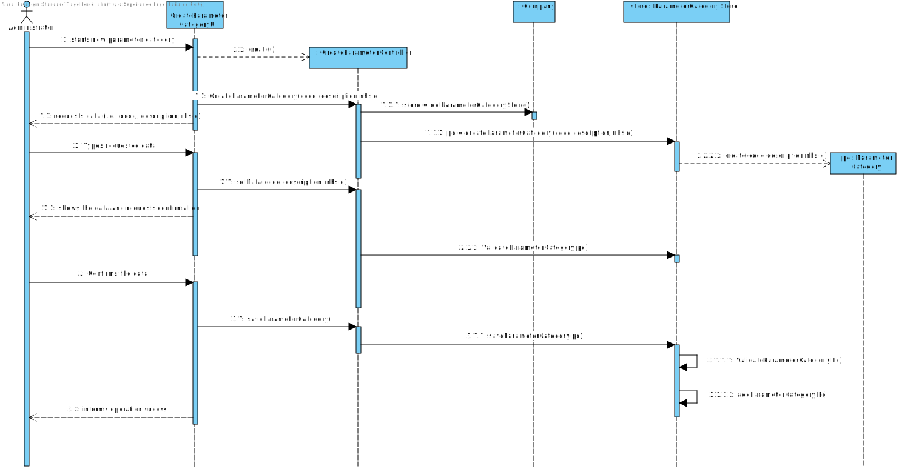
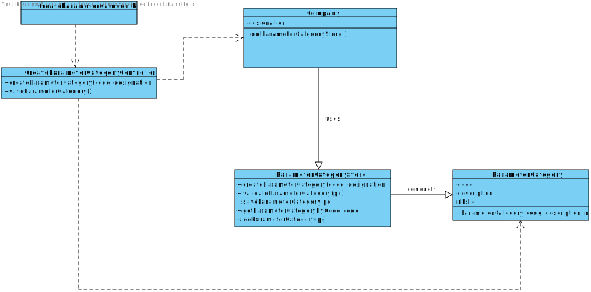

# US 11 - Create Parameter Category

## 1. Requirements Engineering

*In this section, it is suggested to capture the requirement description and specifications as provided by the client as well as any further clarification on it. It is also suggested to capture the requirements acceptance criteria and existing dependencies to other requirements. At last, identfy the involved input and output data and depicted an Actor-System interaction in order to fulfill the requirement.*

### 1.1. User Story Description

*As an administrator, I want to specify a new parameter category.*

### 1.2. Customer Specifications and Clarifications 

**From the Specifications Document:**

* “Blood tests are frequently characterized by measuring several parameters which for presentation/reporting purposes are organized
by categories. For example, parameters such as the number of Red Blood Cells (RBC), White Blood Cells (RBC) and Platelets (PLT) are
usually presented under the blood count (Hemogram) category.”
  

* “Regardless, such tests rely on measuring one or more parameters that can be grouped/organized by categories.”
  
**From the client clarifications:**
* Question: What are the data that characterize a parameter category?

* Answer: Simply consider a code, a description and an NHS identifier

### 1.3. Acceptance Criteria

* AC1: Code must be unique having 4 to 8 chars

* AC2: Description cannot be empty and has, at maximum, 40 chars

* AC3: NHS identifier is not mandatory

### 1.4. Found out Dependencies

No dependencies were found.

### 1.5 Input and Output Data

**Input Data**

* Typed data: code, description and NHS identified

* Selected data: (none)

**Output Data**
* (In)Success of the operation

### 1.6. System Sequence Diagram (SSD)

### 1.7 Other Relevant Remarks

*Use this section to capture other relevant information that is related with this US such as (i) special requirements ; (ii) data and/or technology variations; (iii) how often this US is held.* 

## 2. OO Analysis

### 2.1. Relevant Domain Model Excerpt

### 2.2. Other Remarks

*Use this section to capture some aditional notes/remarks that must be taken into consideration into the design activity. In some case, it might be usefull to add other analysis artifacts (e.g. activity or state diagrams).* 

## 3. Design - User Story Realization 

### 3.1. Rationale

**The rationale grounds on the SSD interactions and the identified input/output data.**

| Interaction ID  | Question: Which class is responsible for... | Answer  | Justification (with patterns)  |
|:-------------  |:--------------------- |:------------|:---------------------------- |
| Step 1: Starts new parameter category		 |...instantiating a new ParameterCategory| Company| Creator: R1/2                              |
| Step 2: request data (i.e., code, description, nhsId)| n/a |              |                              |
| Step 3: types requested data 		 |	...saving the input data?| Parameter Category             |      IE: The Object created in step 1 has its own data. |
| Step 4: shows the data and requests a confirmation  |	...validating the data locally(eg.: mandatory vs non-mandatory data)? |Parameter Category           |IE: knows its own data.  |
| Step 4: shows the data and requests a confirmation  |	...validating the data globally(eg.: duplicated)? |Company          |IE: knows all the ParameterCategory objects.  |
| Step 5: confirms the data 		 | ...saving the created parameter category?| Company             |  IE: adopts/records all the ParameterCategory objects                   |
| Step 6 : informs operation success 		 |	...informing operation success?						 |      UI       |  IE: responsible for user interaction                            |              

### Systematization ##

According to the taken rationale, the conceptual classes promoted to software classes are: 

 * Company
 * ParameterCategory
 

Other software classes (i.e. Pure Fabrication) identified: 
 * CreateCategoryUI (applying the "pure fabrication" pattern)
 * CreateCategoryController (applying the "controller" pattern)

## 3.2. Sequence Diagram (SD)

*In this section, it is suggested to present an UML dynamic view stating the sequence of domain related software objects' interactions that allows to fulfill the requirement.* 

## 3.3. Class Diagram (CD)

*In this section, it is suggested to present an UML static view representing the main domain related software classes that are involved in fulfilling the requirement as well as and their relations, attributes and methods.*

# 4. Tests 
*In this section, it is suggested to systematize how the tests were designed to allow a correct measurement of requirements fulfilling.* 

**_DO NOT COPY ALL DEVELOPED TESTS HERE_**

**Test 1:** Check that it is not possible to create an instance of the Example class with null values. 

	@Test(expected = IllegalArgumentException.class)
		public void ensureNullIsNotAllowed() {
		Exemplo instance = new Exemplo(null, null);
	}

*It is also recommended to organize this content by subsections.* 

# 5. Construction (Implementation)

*In this section, it is suggested to provide, if necessary, some evidence that the construction/implementation is in accordance with the previously carried out design. Furthermore, it is recommeded to mention/describe the existence of other relevant (e.g. configuration) files and highlight relevant commits.*

*It is also recommended to organize this content by subsections.* 

# 6. Integration and Demo 

*In this section, it is suggested to describe the efforts made to integrate this functionality with the other features of the system.*

# 7. Observations

*In this section, it is suggested to present a critical perspective on the developed work, pointing, for example, to other alternatives and or future related work.*

