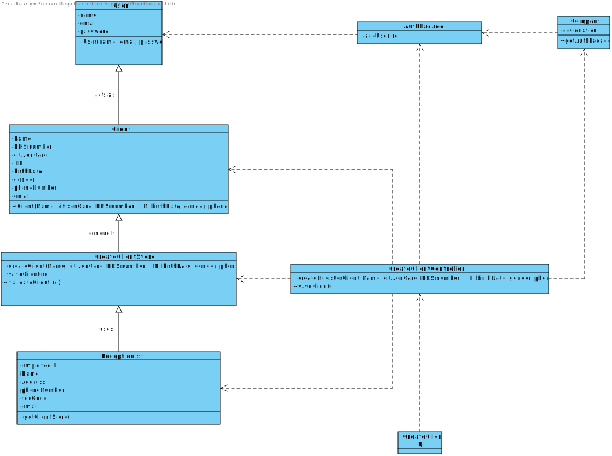

# US 3 - Register a Client

## 1. Requirements Engineering

*In this section, it is suggested to capture the requirement description and specifications as provided by the client as well as any further clarification on it. It is also suggested to capture the requirements acceptance criteria and existing dependencies to other requirements. At last, identfy the involved input and output data and depicted an Actor-System interaction in order to fulfill the requirement.*

### 1.1. User Story Description

*As a receptionist of the laboratory, I want to register a client.*

### 1.2. Customer Specifications and Clarifications 

**From the Specifications Document:**

* "The  set of Many Labs clinical analysis laboratories form a network that covers all England and it is
  responsible for collect ing samples and interact ing with clients ."
  

* "Typically,  the client arrives at one of the clinical analysis laboratories with a lab order prescribed by
  a doctor . Once there a receptionist asks the client ’s citizen card number, the lab order which
  contains the type of test and parameters to be measure d and registers in the application the test to
  be performed to that client Then, the client should wait until a medical lab technician calls him /her
  to collect the samples required to perform a given test."
  

* "In case of  a new client , the receptionist register s the client in the application. To register a client the
  receptionist needs the client’s citizen c ard number, National Healthcare Service ( number,
  birth date, sex, Tax Identification number ( TIF) phone number, e-mail and name"

* Acceptance Criteria: The client must become a system user. The "auth" component
  available on the repository must be reused (without modifications).

**From the client clarifications:**

 * Q: "To register a client the receptionist needs the client’s citizen card number, National Healthcare Service (NHS) number, birth date, sex, Tax Identification number (TIF), phone number, e-mail and name. Which type/format they should have?"

* A: "Citizen Card" - 16 digit number  
"NHS" - 10 digit number  
"TIN"  - 10 digit number  
"Birth date - in which format?"  - DD/MM/YY  
Sex - should only be Male/Female or include more options. - Male/Female  
Phone number: which lenght/format?  - 11 digit number"  
  

* Q: "Also, are all the fields required/mandatory?"
* A: "The phone number is opcional. All other fields are required."

* Q: "Does the receptionist need to be logged in the app to preform the regist."
* A: "Yes."

### 1.3. Acceptance Criteria

* AC1 : When registering a client, all fields except phone number need to be fulfilled.
* AC2 : When registering a client, the receptionist needs to be logged in.
* AC3 : No client can be created with the same Citizen Card, NHS or TIN number.
* AC4 : When the Client is registered, a ten digit alphanumeric password should be randomly generated. 
* AC5 : The Client must become a system user.
* ACX : The user story ends successfully when a client is registered and associated with a test.

### 1.4. Found out Dependencies

*Identify here any found out dependency to other US and/or requirements.*

### 1.5 Input and Output Data

**Input Data**

* Typed data: Name, Citizen Card, Nhs number, TIN, Birth date, Phone Number, Name and Email

* Selected data: gender(male/female)

**Output Data**
* (In)Success of the operation

### 1.6. System Sequence Diagram (SSD)

*Insert here a SSD depicting the envisioned Actor-System interactions and throughout which data is inputted and outputted to fulfill the requirement. All interactions must be numbered.*

### 1.7 Other Relevant Remarks

*Use this section to capture other relevant information that is related with this US such as (i) special requirements ; (ii) data and/or technology variations; (iii) how often this US is held.* 

## 2. OO Analysis

### 2.1. Relevant Domain Model Excerpt 
*In this section, it is suggested to present an excerpt of the domain model that is seen as relevant to fulfill this requirement.* 

### 2.2. Other Remarks

*Use this section to capture some aditional notes/remarks that must be taken into consideration into the design activity. In some case, it might be usefull to add other analysis artifacts (e.g. activity or state diagrams).* 

## 3. Design - User Story Realization 

### 3.1. Rationale

**The rationale grounds on the SSD interactions and the identified input/output data.**

| Interaction ID | Question: Which class is responsible for... | Answer  | Justification (with patterns)  |
|:-------------  |:--------------------- |:------------|:---------------------------- |
| Step 1: Starts new client registration  		 |			...creating a new client?				 |   Recepcionist         | Creator                             |
|Step 2: Requests user data(name, email, pswd) | ...creating a new user? | User | IE:The Object has its own data
| Step 3: requests data(NHS,citizenCard,TIN,birthDate,sex,phoneNumber)  		 |				n/a			 |             |                              |
| Step 4: types requested data 		 |	...saving input data?						 |    Client         | IE: The Object has its own data                             |
| Step 5: shows the data and requested information 		 |	...validating the data globally?						 |  Client           |    IE:Knows its own data                          |
| Step 6:confirms the data		 |		...saving the client?					 |       ClientStore     |           IE: adopts/records all the Client objects                   |
| Step 7:informs operation success  		 |	...informing operation success?						 |      UI       |     IE: responsible for user interaction                         |              

### Systematization ##

According to the taken rationale, the conceptual classes promoted to software classes are: 

 * User
 * Client
*Recepcionist

Other software classes (i.e. Pure Fabrication) identified: 
 * ClientUI  
 * ClientController
 * ClientStore (HC+LC)

## 3.2. Sequence Diagram (SD)

*In this section, it is suggested to present an UML dynamic view stating the sequence of domain related software objects' interactions that allows to fulfill the requirement.* 

## 3.3. Class Diagram (CD)

*In this section, it is suggested to present an UML static view representing the main domain related software classes that are involved in fulfilling the requirement as well as and their relations, attributes and methods.*

# 4. Tests 
*In this section, it is suggested to systematize how the tests were designed to allow a correct measurement of requirements fulfilling.* 

**_DO NOT COPY ALL DEVELOPED TESTS HERE_**

**Test 1:** Check that it is not possible to create an instance of the Example class with null values. 

	@Test(expected = IllegalArgumentException.class)
		public void ensureNullIsNotAllowed() {
		Exemplo instance = new Exemplo(null, null);
	}

*It is also recommended to organize this content by subsections.* 

# 5. Construction (Implementation)

*In this section, it is suggested to provide, if necessary, some evidence that the construction/implementation is in accordance with the previously carried out design. Furthermore, it is recommeded to mention/describe the existence of other relevant (e.g. configuration) files and highlight relevant commits.*

*It is also recommended to organize this content by subsections.*

**Client Class:**
        
        public class Client extends User{
        
        
        private int nhs;
        private int citizenCard;
        private int tin;
        private String birthDate;
        private String sex;
        private int pNumber;

        public Client(String name, String email, String pswd, int nhs, int citizenCard, int tin, String birthDate,String sex, int pNumber){
        super(name,email,pswd);
        this.nhs = nhs;
        this.citizenCard = citizenCard;
        this.tin = tin;
        this.birthDate = birthDate;
        this.sex = sex;
        this.pNumber = pNumber;
        }
        
        public void checkNHS(nhs){
        String check = String.valueOf(nhs);
        if(check.length != 10)
        throw new IllegalArgumentException("NHS number must have 10 chars");
        }

        public void checkCitizenNumber(citizenCard){
        String check = String.valueOf(citizenCard);
        if(check.length != 16)
        throw new IllegalArgumentException("Citizen number must have 16 chars");
        }

        public void checkTIN(tin){
        String check = String.valueOf(tin);
        if(check.length != 12)
        throw new IllegalArgumentException("TIN must have 12 chars");
        }

        public void checkPNumber(pNumber){
        String check = String.valueOf(pNumber);
        if(check.length != 12)
        throw new IllegalArgumentException("TIN must have 12 chars");
        }
    
        public void checkSex(sex){
        if(! sex.equals("Masculino) || ! sex.equals("Feminino"))
        throw new IllegalArgumentException("Não existe esse género!");
        }
        }

**CreateClientStore Class:**

        public classCreateClientStore extends Company{
        private List<Client> clientList;

        public Client createClient(String name, int nhs, int citizenCard, int tin, String birthDate,String sex, int pNumber){
            return new Client(name,email,pswd, nhs, citizenCard; int tin, birthDate, String sex, int pNumber);
        }
        
        public boolean validateClient(Client rc){
        if(rc == null){
            return false;
        return ! this.clientList.add(rc);
        }
        }
        
        public boolean saveClient(Client tp){
        if(!validateClient(rc))
            return false
        return this.clientList.add(rc);
        }
        
       public Client getClientByCitizenCard(int citizenCard){
          for(Client c : clientList){
          if(citizenCard == c.getClientCard)
          return c;}
          return null;
        }

        }

**RecepcionistController Class:**

        private Company company;
        private Client rc;

        public CreateClient(){
            this(App.getInstance().getCompany());
        }
        
        public CreateClient(Company company){
            this.company = company;
            this.rc = null;
        }

        public boolean createClient(String name, int nhs, int citizenCard, int tin, String birthDate, String sex, int pNumber){
            this.rc = this.company.createClient(name,pswd,email, nhs, citizenCard,  tin, birthDate,sex,pNumber);
            return this.company.Client(rc);
        }

        public boolean saveClient(){
            return this.company.saveClient(rc);
        }

**Company Class**

    public class Company{
    
      public CreateClientStore getCreateClientStore(CreateClientStore ccs){
      return ccs;
      }
      
      }
# 6. Integration and Demo 

*In this section, it is suggested to describe the efforts made to integrate this functionality with the other features of the system.*

# 7. Observations

*In this section, it is suggested to present a critical perspective on the developed work, pointing, for example, to other alternatives and or future related work.*

