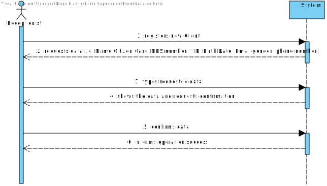

# US 3 - Register a Client

## 1. Requirements Engineering

*In this section, it is suggested to capture the requirement description and specifications as provided by the client as well as any further clarification on it. It is also suggested to capture the requirements acceptance criteria and existing dependencies to other requirements. At last, identfy the involved input and output data and depicted an Actor-System interaction in order to fulfill the requirement.*

### 1.1. User Story Description

*As a receptionist of the laboratory, I want to register a client.*

### 1.2. Customer Specifications and Clarifications 

**From the Specifications Document:**

* "The  set of Many Labs clinical analysis laboratories form a network that covers all England and it is
  responsible for collect ing samples and interact ing with clients ."
  

* "Typically,  the client arrives at one of the clinical analysis laboratories with a lab order prescribed by
  a doctor . Once there a receptionist asks the client ’s citizen card number, the lab order which
  contains the type of test and parameters to be measure d and registers in the application the test to
  be performed to that client Then, the client should wait until a medical lab technician calls him /her
  to collect the samples required to perform a given test."
  

* "In case of  a new client , the receptionist register s the client in the application. To register a client the
  receptionist needs the client’s citizen c ard number, National Healthcare Service ( number,
  birth date, sex, Tax Identification number ( TIF) phone number, e-mail and name"

* Acceptance Criteria: The client must become a system user. The "auth" component
  available on the repository must be reused (without modifications).

**From the client clarifications:**

 * Q: "To register a client the receptionist needs the client’s citizen card number, National Healthcare Service (NHS) number, birth date, sex, Tax Identification number (TIF), phone number, e-mail and name. Which type/format they should have?"

* A: "Citizen Card" - 16 digit number  
"NHS" - 10 digit number  
"TIN"  - 10 digit number  
"Birth date - in which format?"  - DD/MM/YY  
Sex - should only be Male/Female or include more options. - Male/Female  
Phone number: which lenght/format?  - 11 digit number"  
  

* Q: "Also, are all the fields required/mandatory?"
* A: "The phone number is opcional. All other fields are required."

* Q: "Does the receptionist need to be logged in the app to preform the regist."
* A: "Yes."

### 1.3. Acceptance Criteria

* AC1 : All attributes can not be empty.
* AC2 : No client can be created with the same Citizen Card, NHS or TIN number.
* AC3 : When the Client is registered, a ten digit alphanumeric password should be randomly generated. 
* AC4 : The Client must become a system user.

### 1.4. Found out Dependencies

This US needs to use the methods and facilities of the Authentication System to Work.

### 1.5 Input and Output Data

**Input Data**

* Typed data: Name, Citizen Card, Nhs number, TIN, Birth date, Phone Number, Name and Email

* Selected data: gender(male/female)

**Output Data**
* (In)Success of the operation

### 1.6. System Sequence Diagram (SSD)

*Insert here a SSD depicting the envisioned Actor-System interactions and throughout which data is inputted and outputted to fulfill the requirement. All interactions must be numbered.*

### 1.7 Other Relevant Remarks

*Use this section to capture other relevant information that is related with this US such as (i) special requirements ; (ii) data and/or technology variations; (iii) how often this US is held.* 

## 2. OO Analysis

### 2.1. Relevant Domain Model Excerpt 
*In this section, it is suggested to present an excerpt of the domain model that is seen as relevant to fulfill this requirement.* 

### 2.2. Other Remarks

*Use this section to capture some aditional notes/remarks that must be taken into consideration into the design activity. In some case, it might be usefull to add other analysis artifacts (e.g. activity or state diagrams).* 

## 3. Design - User Story Realization 

### 3.1. Rationale

**The rationale grounds on the SSD interactions and the identified input/output data.**

| Interaction ID | Question: Which class is responsible for... | Answer  | Justification (with patterns)  |
|:-------------  |:--------------------- |:------------|:---------------------------- |
| Step 1: registers new Client 		 |			...creating a new client?				 |   Receptionist -> CreateClientStore        | Based on the Creator standard (Receptionist used to store the list of all Client ) on the MD, the responsibility is attributed to the Receptionist. By application of HC + LC in Receptionist the responsibility is delegated to CreateClientStore                           |
| Step 2: requests data(i.e., Name, citizenCard, NHS number,TIN,birthDate,gender,phoneNumber)  		 |				n/a			 |             |                              |
| Step 3: types requested data 		 |	...saving input data?						 |    Client         | IE:the object created in the first step has knowledge of its own data.                      |
| Step 4: shows the data and requested confirmation 		 |	...validating the data according to AC?						 |  Client          |   IE: Know its own creation rules.                  |
| Step 4: shows the data and requested confirmation 		 |	...validating the data persistence?						 |  Receptionist -> CreateClientStore          |   Based on the IE (Receptionist used to know all the Client Objects ) but, with the application of HC+LC in Receptionist, the responsibility it's know delegated to CreateClientStore                  |
| Step 5: confirms the data		 |		...saving the Client registered?				 |  Receptionist -> CreateClientStore      |        Based on the IE standard on the MD, the responsibility is attributed to the Receptionist. By application of HC + LC in Receptionist the responsibility is delegated to CreateClientStore, as previously stated.                   |
| Step 5: confirms the data		 |		...create Client as a User of the System?				 |   AuthFacade     |    IE:As the information regarding this procedure                       |
| Step 6: informs operation success  		 |	...informing operation success?						 |      CreateClientUI       |     IE: responsible for user interaction                         |              

### Systematization ##

According to the taken rationale, the conceptual classes promoted to software classes are: 

 * User
 * Client
 * Receptionist
 * Company

Other software classes (i.e. Pure Fabrication) identified: 
 * ClientUI  (UI)
 * ClientController (Controller)
 * CreateClientStore (HC+LC)
 * AuthFacade

## 3.2. Sequence Diagram (SD)

*In this section, it is suggested to present an UML dynamic view stating the sequence of domain related software objects' interactions that allows to fulfill the requirement.* 

## 3.3. Class Diagram (CD)

*In this section, it is suggested to present an UML static view representing the main domain related software classes that are involved in fulfilling the requirement as well as and their relations, attributes and methods.*

# 4. Tests 
*In this section, it is suggested to systematize how the tests were designed to allow a correct measurement of requirements fulfilling.* 

**_DO NOT COPY ALL DEVELOPED TESTS HERE_**

**Test 1:** Check that it is not possible to create an instance of the Example class with null values. 

	@Test(expected = IllegalArgumentException.class)
		public void ensureNullIsNotAllowed() {
		Exemplo instance = new Exemplo(null, null);
	}

*It is also recommended to organize this content by subsections.* 

# 5. Construction (Implementation)

*In this section, it is suggested to provide, if necessary, some evidence that the construction/implementation is in accordance with the previously carried out design. Furthermore, it is recommeded to mention/describe the existence of other relevant (e.g. configuration) files and highlight relevant commits.*

_In order to have a more coherent and faster application, the coding team proposed some changes to our Designs. Most of them are related with the storage of Client information. Instead of being stored in association with the Receptionist, they suggest it should be stored in a higher level (Company)._

**CreateClientUI:**

In this class, the UI will ask the user information about the client, with that done, it will send it to the controller, so it can get the information to warn the user if the Client got successfully into the system.

      public class CreateClientUI {
      }

**Client Class:**

This class is the Client, object maker, it has the Client attributes, and it has the methods to validate those attributes.

    
        public class Client {
               
        private String name;
        private Email id;
        private long nhs;
        private long citizenCard;
        private long tin;
        private Date birthDate;
        private String sex;
        private long pNumber;

        public Client(Email id, String name, long nhs, long citizenCard, long tin, Date birthDate, String sex, long pNumber){

        this.name=name;
        this.id=id;
        this.nhs = nhs;
        this.citizenCard = citizenCard;
        this.tin = tin;
        this.birthDate = birthDate; //fazer check birthdate
        this.sex = sex;
        this.pNumber = pNumber;
        }
        }

**CreateClientStore Class:**

The CreateClientStore class, will save the Clients in an ArrayList so they can be called anytime when they're needed, the class will also validate and save clients into the system.

        public classCreateClientStore {
        private List<Client> clientList;

        public Client createClient(String id, String name, long nhs, long citizenCard, long tin, String birthDate, String sex, long pNumber ){
        Email email = new Email(id);
        return new Client(email, name, nhs, citizenCard, tin, birthDateFormat, sex, pNumber);
        }
        
        public boolean validateClient(Client rc){
        if(rc == null){
            return false;
        return ! this.clientList.add(rc);
        }
        }
        
        public boolean saveClient(Client tp){
        if(!validateClient(rc))
            return false
        return this.clientList.add(rc);
        }
        }

**CreateClientController Class:**

The CreateClienttController is the communicator between the CreateClientUI and the rest of the system, this class will send the Client data, sent by the user, to some CreateClientStore methods, so it can be validated.

    public class CreateClientController {

    private Company company;
    private CreateClientStore createClientStore;
    Client rc;

    public boolean createClient(String id, String name, long nhs, long citizenCard, long tin, String birthDate, String sex, long pNumber,String testpass){

        this.rc = this.CreateClientStore.createClient(id,name,nhs,citizenCard,tin,birthDate,sex,pNumber);

        if(!this.createClientStore.validateClient(this.rc)){return false;}

        saveClient(this.rc,testpass);
        return true;

    }

    public boolean saveClient(){
        return this.CreateClientStore.saveClient(this.rc);
    }

**Company Class**

    
    public class Company{
    private String designation;
    private AuthFacade authFacade;    

    public void getAuthFacade(){
           return Company.authFacade;      
    }  
    }

**Receptionist Class**

    public class Receptionist{
    private String email;
    private String employeeId;
    private String name;
    private String address;
    private String phoneNumber;
    private String socCode;   
    private CreateClientStore createClientStore;

    public void getClientStore(){
           return createClientStore;      
    }  
    }

**User Class**

    public class User{
    private String email;
    private String password;
    private String name;   

    public User(Email email, Password password, String name){

        this.name=name;
        this.password=password; 
        this.email=email;
    }
    }

**AuthFacade Class**

    public class AuthFacade{   

    public bollean addUser(rc){
        String name = this.rc.name;
        String email = this.rc.email;
        String password = "XXXXXXXXXX"
        User user = this.users.create(name, email,password );
        return this.users.add(user);
    } 
    }

# 6. Integration and Demo 

*In this section, it is suggested to describe the efforts made to integrate this functionality with the other features of the system.*

# 7. Observations

In this US it's assumed that the receptionist is logged in the System with validated access.
Because of this the team didn't felt the need to add information about these steps in this US.

