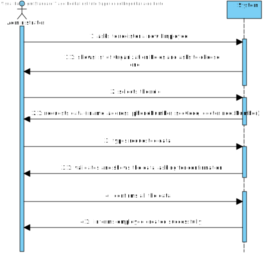
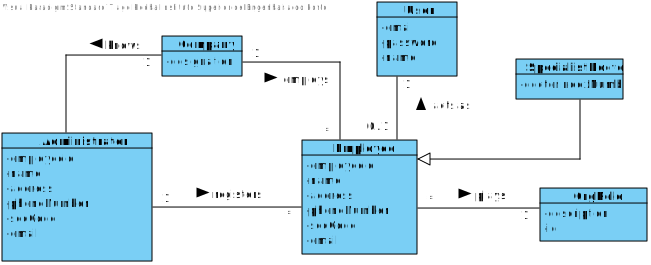
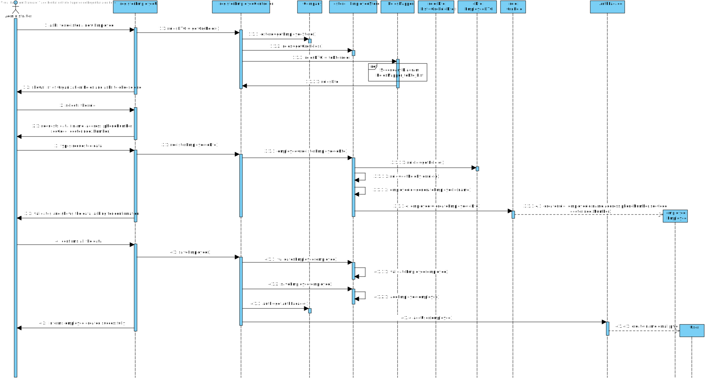
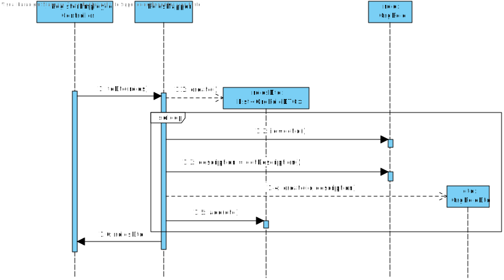
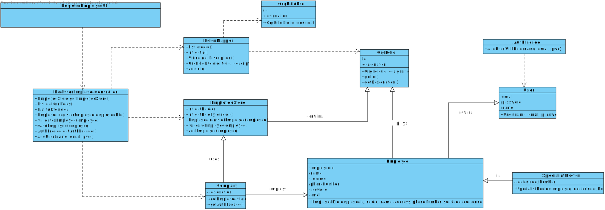

# US 7 - Register a new Employee

## 1. Requirements Engineering

*In this section, it is suggested to capture the requirement description and specifications as provided by the client as well as any further clarification on it. It is also suggested to capture the requirements acceptance criteria and existing dependencies to other requirements. At last, identfy the involved input and output data and depicted an Actor-System interaction in order to fulfill the requirement.*

### 1.1. User Story Description

*As an administrator, I want to register a new employee.*

### 1.2. Customer Specifications and Clarifications 

**From the client clarifications:**
All the roles that exist in the Many Labs company are characterized by the following attributes:
Employee ID,
Organization Role,
Name,
Address,
Phone Number,
E-Mail,
Standard Occupational Classification (SOC) code.

Only the employee ID should be generated from the initials of the employee name and should include a number. The number has 5 digits and is increases automatically when a new employee is registered in the system. For instance, if the company has 20 employees and wants to register a specialist doctor having the name Ana Maria Santos Moura, then the the employee ID for this specialist doctor should be AMSM00021.

The Specialist Doctor has an additional attribute:
Doctor Index Number, that should be introduced by the administrator.

### 1.3. Acceptance Criteria

* AC1: Each user must have a single role defined in the system.
* AC2: All atributtes can not be empty.
* AC3: Phone number must be unique.

### 1.4. Found out Dependencies

No dependencies were found.

### 1.5 Input and Output Data

**Selected Data:** organization role

**Input Data:** name, address, phone number, soc code, doctor index number

**Output Data:** (in)sucess of the operation 

### 1.6. System Sequence Diagram (SSD)

*Insert here a SSD depicting the envisioned Actor-System interactions and throughout which data is inputted and outputted to fulfill the requirement. All interactions must be numbered.*

### 1.7 Other Relevant Remarks

* Employee attributes "Employee ID" and "Email" are generated by the system during the creation.

## 2. OO Analysis

### 2.1. Relevant Domain Model Excerpt 
*In this section, it is suggested to present an excerpt of the domain model that is seen as relevant to fulfill this requirement.* 

### 2.2. Other Remarks

*Use this section to capture some aditional notes/remarks that must be taken into consideration into the design activity. In some case, it might be usefull to add other analysis artifacts (e.g. activity or state diagrams).* 

## 3. Design - User Story Realization 

### 3.1. Rationale

**The rationale grounds on the SSD interactions and the identified input/output data.**

| Interaction ID | Question: Which class is responsible for... | Answer  | Justification (with patterns)  |
|:-------------  |:--------------------- |:------------|:---------------------------- |
| Step 1: asks to register a new Employee   		 |	...instantiating a new Employee?						 |   EmployeeStore          |  HC + LC                            |
| Step 2: shows list of Organization Roles and asks to choose one 		 |	...listing all OrgRoles?					 |    EmployeeStore + RolesMapper         |        HC + LC: EmployeeStore knows all OrgRoles. Dto: RolesMapper creates list of OrgRolesDto.                   |
| Step 3: selects the role  		 |	...saving the role selected?						 |  EmployeeDto           |  DTO: EmployeeDto has the information of the new Employee and the role selected.                            |
| Step 4: requests data ( name, address, phoneNumber, socCode, doctorIndexNumber) 		 |	n/a						 |             |                              |
| Step 5: types requested data  		 |	...saving the input data?						 |  EmployeeDto           |  DTO: Same as step 3.                           |
| Step 6: validates and shows the data, asking for confirmation  		 |	...validating the data locally(eg.: mandatory vs non-mandatory data)?						 |    Employee         |    IE: knows its own data.                          |
|   		 |	...validating the data globally(eg.: duplicated)?					 |    EmployeeStore         |    IE: knows all the Employee objects.                          |
| Step 7: confirms all the data  		 |	...saving the created Employee						 |   EmployeeStore          |    IE: adopts/records all the Employee objects                          |
| Step 8: informs employee created sucessfully  		 |	...informing operation success?						 |   UI          |    IE: responsible for user interaction                          |              

### Systematization ##

According to the taken rationale, the conceptual classes promoted to software classes are: 

 Employee
 OrgRole
 Company
 User

Other software classes (i.e. Pure Fabrication) identified: 

registerEmployeeUI (applying the "pure fabrication" pattern)
registerEmployeeController (applying the "controller" pattern)
EmployeeStore (HC+LC)
RolesMapper ("DTO" pattern)
EmployeeDTO ("DTO" pattern) 
OrgRoleDto ("DTO" pattern)
AuthFacade

## 3.2. Sequence Diagram (SD)

*In this section, it is suggested to present an UML dynamic view stating the sequence of domain related software objects' interactions that allows to fulfill the requirement.* 

Main Diagram:

Secondary Diagram:

## 3.3. Class Diagram (CD)

*In this section, it is suggested to present an UML static view representing the main domain related software classes that are involved in fulfilling the requirement as well as and their relations, attributes and methods.*

# 4. Tests 
*In this section, it is suggested to systematize how the tests were designed to allow a correct measurement of requirements fulfilling.* 

**_DO NOT COPY ALL DEVELOPED TESTS HERE_**

**Test 1:** Check that it is not possible to create an instance of the Example class with null values. 

	@Test(expected = IllegalArgumentException.class)
		public void ensureNullIsNotAllowed() {
		Exemplo instance = new Exemplo(null, null);
	}

*It is also recommended to organize this content by subsections.* 

# 5. Construction (Implementation)

*In this section, it is suggested to provide, if necessary, some evidence that the construction/implementation is in accordance with the previously carried out design. Furthermore, it is recommeded to mention/describe the existence of other relevant (e.g. configuration) files and highlight relevant commits.*

*It is also recommended to organize this content by subsections.* 

# 6. Integration and Demo 

*In this section, it is suggested to describe the efforts made to integrate this functionality with the other features of the system.*

# 7. Observations

*In this section, it is suggested to present a critical perspective on the developed work, pointing, for example, to other alternatives and or future related work.*

