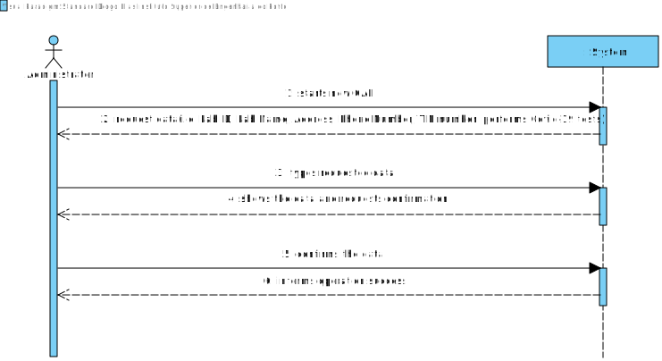
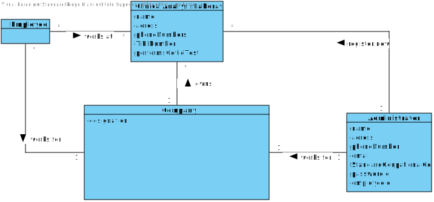
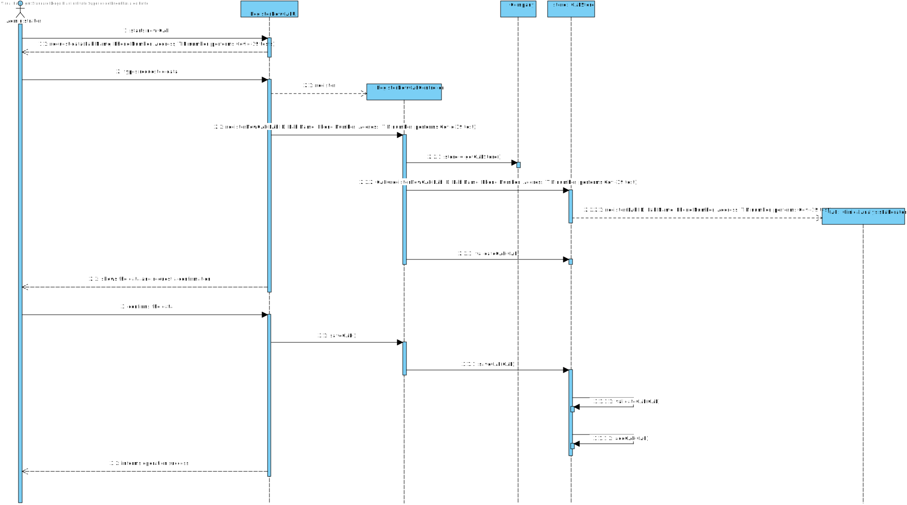

# US 8 - Register new clinical analysis laboratory and specify tests done there

## 1. Requirements Engineering

*In this section, it is suggested to capture the requirement description and specifications as provided by the client as well as any further clarification on it. It is also suggested to capture the requirements acceptance criteria and existing dependencies to other requirements. At last, identfy the involved input and output data and depicted an Actor-System interaction in order to fulfill the requirement.*

### 1.1. User Story Description

*As an administrator, I want to register a new clinical analysis laboratory stating which kind of test(s) it operates.*

### 1.2. Customer Specifications and Clarifications 

**From the Specifications Document:**

* "Many Labs is a company that operates in the English market, it has headquarters in London and has
  a network of clinical analysis laboratories in England where analysis of blood (samples are
  collected) are performed, as well as Covid-19 tests."
  
  
* "All Many Labs clinical analysis laboratories perform clinical blood tests and a subset of
  these laboratories also performs Covid-19 tests."

**From the client clarifications:**

* Q1: "And what about the Clinical Analysis Laboratory and Chemical Laboratory? Do they have common attributes like an identification number, number of employees who work there, location, etc.?"
* A1: "Each Clinical Analysis Laboratory is characterized by the following attributes:
  Laboratory ID;
  Name;
  Address;
  Phone Number;
  TIN number."
  

* Q2: " it is possible for a given employee to work at more than one lab? "
* A2: "Each Receptionist and each Medical Lab Technician can work in any Clinical Analysis Laboratory of the Many Labs network."

### 1.3. Acceptance Criteria

* AC1: New CLAs cannot be registered without the necessary employees (a Receptionist and Medical Lab Technician)
* AC2: A CLA's must have an attribute specifying the type of tests it performs
* AC3: A CLA's must always perform blood tests.
* AC4: A CLA cannot be registered without Laboratory ID, Name, Address, Phone Number, TIN number and the type of tests it performs.

### 1.4. Found out Dependencies

No dependencies were found.

### 1.5 Input and Output Data

**Input Data**

* Typed data: Lab Name, Address, Phone Number and TIN number.

* Selected data: Performs Covid-19 Test (Yes or No).

**Output Data**
* (In)Success of the operation

### 1.6. System Sequence Diagram (SSD)

### 1.7 Other Relevant Remarks

Employees may need to be registered when lab is registered

## 2. OO Analysis

### 2.1. Relevant Domain Model Excerpt 

### 2.2. Other Remarks

Attributes may need to be fulfilled 

## 3. Design - User Story Realization 

### 3.1. Rationale

**The rationale grounds on the SSD interactions and the identified input/output data.**

| Interaction ID | Question: Which class is responsible for... | Answer  | Justification (with patterns)  |
|:-------------  |:--------------------- |:------------|:---------------------------- |
| Step 1  : starts new CLA	 |		...creating a new CLA?   |  Company           |             Creator                 |
| Step 2  : requests data(Lab Name, Address, Phone Number, TIN Number)		 |			n/a				 |             |                              |
| Step 3  : types requested data		 |			...saving the input data? 				 |     CLA        | IE: the object created in the first step has its own data.                             |
| Step 4  : show the data and request data(performs covid-19 tests)		 |		...validate that the data is according AC?					 |   CLA          |   IE: Know its own creation rules                           |
| Step 4  : show the data and request data(performs covid-19 tests)		 |		...validate the data persistence?					 |        Company     |      IE: Knows all the CLA objects                        |
| Step 5  : types requested data	 |				...saving the input	data?		 |       CLA      | IE: the object created in the first step has its own data.                            |
| Step 6  : shows the data and requests confirmation		 |			...validate the input data?				 |    CLA         |    IE: Know its own creation rules                           |              
| Step 7  : confirms data		 |				...saving the CLA registered?			 |      Company       |     IE:Records information about all objects of CLA                         |              
| Step 7  : informs operation success		 |			...informing operation success?				 |      UI       |    IE:Responsible for user interaction                           |              

### Systematization ##

According to the taken rationale, the conceptual classes promoted to software classes are: 

 * Company
 * CLA

Other software classes (i.e. Pure Fabrication) identified: 
 * RegisterNewCLAUI  (applying the "pure fabrication" pattern)
 * RegisterNewCLAController (applying the "Controller" pattern)

## 3.2. Sequence Diagram (SD)

## 3.3. Class Diagram (CD)

*In this section, it is suggested to present an UML static view representing the main domain related software classes that are involved in fulfilling the requirement as well as and their relations, attributes and methods.*

# 4. Tests 
*In this section, it is suggested to systematize how the tests were designed to allow a correct measurement of requirements fulfilling.* 

**_DO NOT COPY ALL DEVELOPED TESTS HERE_**

**Test 1:** Check that it is not possible to create an instance of the Example class with null values. 

	@Test(expected = IllegalArgumentException.class)
		public void ensureNullIsNotAllowed() {
		Exemplo instance = new Exemplo(null, null);
	}

*It is also recommended to organize this content by subsections.* 

# 5. Construction (Implementation)

*In this section, it is suggested to provide, if necessary, some evidence that the construction/implementation is in accordance with the previously carried out design. Furthermore, it is recommeded to mention/describe the existence of other relevant (e.g. configuration) files and highlight relevant commits.*

*It is also recommended to organize this content by subsections.* 

# 6. Integration and Demo 

*In this section, it is suggested to describe the efforts made to integrate this functionality with the other features of the system.*

# 7. Observations

* Questions posed to client and waiting 

* Reservations regarding the registration of the new CLA

* Registration of employees

