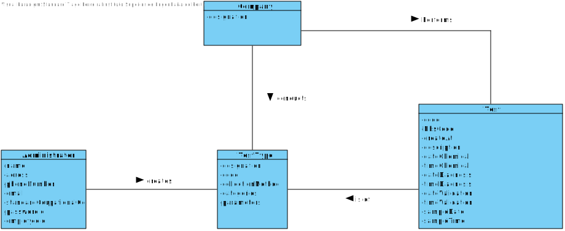
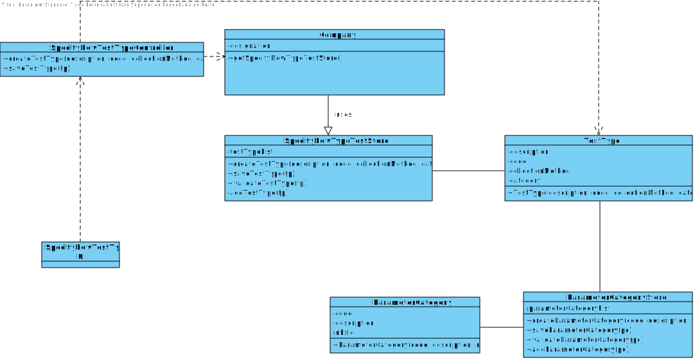

# US 9 - Specify new Type Test 

## 1. Requirements Engineering

*In this section, it is suggested to capture the requirement description and specifications as provided by the client as well as any further clarification on it. It is also suggested to capture the requirements acceptance criteria and existing dependencies to other requirements. At last, identfy the involved input and output data and depicted an Actor-System interaction in order to fulfill the requirement.*

### 1.1. User Story Description

*As an administrator, I want to specify a new type of test and its collecting methods*

### 1.2. Customer Specifications and Clarifications 

**From the Specification Document:**
* "Despite being out of scope, the system should be developed having in mind the need to
  easily support other kinds of tests (e.g., urine). Regardless, such tests rely on measuring one
  or more parameters that can be grouped/organized by categories."

### 1.3. Acceptance Criteria

* AC1: A new test type must at least have one parameter

### 1.4. Found out Dependencies

*No dependencies were found.*

### 1.5 Input and Output Data

**Input Data**
* **Typed Data:** designation name, test type  Id, collecting methods
* **Selected Data:** (none) 

### 1.6. System Sequence Diagram (SSD)

*Insert here a SSD depicting the envisioned Actor-System interactions and throughout which data is inputted and outputted to fulfill the requirement. All interactions must be numbered.*

### 1.7 Other Relevant Remarks

*Use this section to capture other relevant information that is related with this US such as (i) special requirements ; (ii) data and/or technology variations; (iii) how often this US is held.* 

## 2. OO Analysis

### 2.1. Relevant Domain Model Excerpt 
*In this section, it is suggested to present an excerpt of the domain model that is seen as relevant to fulfill this requirement.* 

### 2.2. Other Remarks

*Use this section to capture some aditional notes/remarks that must be taken into consideration into the design activity. In some case, it might be usefull to add other analysis artifacts (e.g. activity or state diagrams).* 

## 3. Design - User Story Realization 

### 3.1. Rationale

**The rationale grounds on the SSD interactions and the identified input/output data.**

| Interaction ID | Question: Which class is responsible for... | Answer  | Justification (with patterns)  |
|:-------------  |:--------------------- |:------------|:---------------------------- |
| Step 1: Starts a new type of test 		 |	...creating a type of test?						 |      Company     |    Creator.                        |
| Step 2: Requests designation		 |	...n/a						 |             |                              |
| Step 3: Types designation 		 |	...saving input data?						 |     TestType        |         IE: The Object created has its own data.                     |
| Step 4: requests the collecting methods 		 |		n/a					 |     |                      |
| Step 5: types the collecting methods		 |				...saving input data?			 |   TestType          |    IE: The Object created in step 3 has its own data.                       |
| Step 6: shows the data and requests confirmation 		 |		...validating the data globally?			 |      TestType       |         IE: knows its own data                     |       
| Step 7: confirms the data |  ...saving the created test type? | TestType | IE: adopts/records all the TestType objects
| Step8: informs operation success | ...informing operation success? | UI | IE: responsible for user interaction|

### Systematization ##

According to the taken rationale, the conceptual classes promoted to software classes are: 

 * Class1
 * Class2
 * Class3

Other software classes (i.e. Pure Fabrication) identified: 
 * xxxxUI  
 * xxxxController

## 3.2. Sequence Diagram (SD)

*In this section, it is suggested to present an UML dynamic view stating the sequence of domain related software objects' interactions that allows to fulfill the requirement.* 

## 3.3. Class Diagram (CD)

*In this section, it is suggested to present an UML static view representing the main domain related software classes that are involved in fulfilling the requirement as well as and their relations, attributes and methods.*

# 4. Tests 
*In this section, it is suggested to systematize how the tests were designed to allow a correct measurement of requirements fulfilling.* 

**_DO NOT COPY ALL DEVELOPED TESTS HERE_**

**Test 1:** Check that it is not possible to create an instance of the Example class with null values. 

	@Test(expected = IllegalArgumentException.class)
		public void ensureNullIsNotAllowed() {
		Exemplo instance = new Exemplo(null, null);
	}

*It is also recommended to organize this content by subsections.* 

# 5. Construction (Implementation)

*In this section, it is suggested to provide, if necessary, some evidence that the construction/implementation is in accordance with the previously carried out design. Furthermore, it is recommeded to mention/describe the existence of other relevant (e.g. configuration) files and highlight relevant commits.*

*It is also recommended to organize this content by subsections.* 

**TestType Class:**

    public class TestType{
    
    private String designationName;
    private int TestTypeId;
    private ArrayList <String> collectMethods = new ArrayList<>();

    public TestType(String designationName, int TestTypeId, ArrayList <String> collectMethods){
      this.designationName = designationName;
      this.TestTypeId = TestTypeId;
      this.collectMethods = collectMethods;
    }

    private void checkMethods(ArrayList <String> collectMethods){
    if(collectMethods.size == 0)
      throw new IllegalArgumentException("Test type must at least have one collecting method");
    }
    }

**Company Class:**

    public class Company{
    
    private ArrayList <TestType> TestTypeList;

     public TestType createNewTestType(String designationName, int TestTypeId, ArrayList <String> collectMethods){
            return new TestType(designation, TestTypeId, collectMethods);
        }
    public boolean validateTestType(TestType tp){
      if(tp == null)
        return false;
      return ! this.TestTypeList.contains(tp);
    }

    public boolean saveTestType(TestType tp){
        if(!validateTestType(tp))
            return false
        return this.TestTypeList.add(tp);
        }
        
    }

**SpecifyNewTypeTestController Class:**

    public class SpecifyNewTypeTestController{
    
    private Company company;
    private TestType testType;

    public SpecifyNewTypeTestController(){
      this(App.getInstance().getCompany());
    }

    public SpecifyNewTypeTestController(Company company){
    this.company = company;
    this.tp = null;
    }

    public boolean createTestType(String designationName, int testTypeId, ArrayList <String> collectMethods){
            this.tp = this.company.createTestType(designationName, testTypeId, collectMethods);
            return this.company.validateTestType(tp);
        }

        public boolean saveTestType(){
            return this.company.saveTestType(tp);
        }
    }
# 6. Integration and Demo 

*In this section, it is suggested to describe the efforts made to integrate this functionality with the other features of the system.*

# 7. Observations

*In this section, it is suggested to present a critical perspective on the developed work, pointing, for example, to other alternatives and or future related work.*

