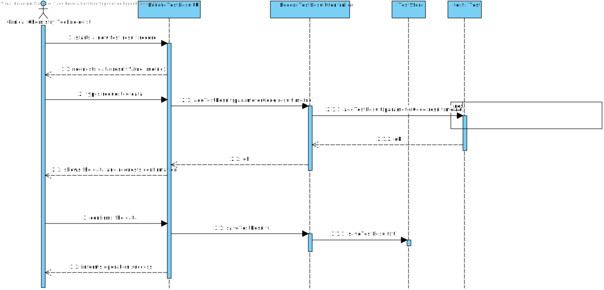

# US 012 - Record Tests Result

## 1. Requirements Engineering

*In this section, it is suggested to capture the requirement description and specifications as provided by the client as well as any further clarification on it. It is also suggested to capture the requirements acceptance criteria and existing dependencies to other requirements. At last, identfy the involved input and output data and depicted an Actor-System interaction in order to fulfill the requirement.*

### 1.1. User Story Description

As a clinical chemistry technologist, I intend to record the results of a given test.

### 1.2. Customer Specifications and Clarifications 

**Q1:** The results of the tests can be negative or there are any restriction in this particular variable?

**A1:** The result/value of one parameter is related with the type of parameter we are measuring. To get an idea, please check the values returned by the external modules (jar APIs).

**Q2:** When you intend to record the results of the Blood Test, do you want to introduce all results for all parameters or just only one?

**A2:** The clinical chemistry technologist should record all results related to a test at a given time/moment.

**Q3:** According to the project description the external modules should be used by the specialist doctor when creating the diagnosis, so, shouldn't the acceptance criteria of the external modules be applied on US 014 instead of US 012?

**A3:** The reference values should be presented both to the clinical chemistry technologist (US12) and to the specialist doctor (US14). In the Project description we get: "To facilitate and simplify the validation work [make a diagnosis and write a report] performed by the specialist doctor, the application uses an external module that is responsible for doing an automatic validation using test reference values.

**Q4:** What information is the system going to have to ask the clinical chemistry technologist to be able to create the test results?

**A4.1:** The clinical chemistry technologist should use the sample barcode number to find (in the system) the test for which the sample was collected.

**A4.2:** The Clinical Chemistry Technologist should register a value/result for each parameter of the (selected) test.
All parameter values of the test should be filled/defined (by the Clinical Chemistry Technologist) when the use case finishes.

From the Acceptance Criteria we get that "the API request should include, at most: (i) a key to access the module (e.g.: “KEY1234”); (ii) a parameter identifier; (iii) the reference date; and (iv) reference measurement unit (e.g. "mg")."

**Q5:** Does this "at most" express that there are some parameters of the API request that are optional? If so, could you clarify the parameters that are optional?

**A5:** "At most" means the maximum number of parameters that will be used. Depending on the API being used, all parameters above may be required or some may be optional.The number of parameters depends on the API that is being used.

### 1.3. Acceptance Criteria

**AC1:** The application should use an external module that is responsible
for providing the test reference values. The application can use an external module for
each type of test.

**AC2:** For instance, when the results are for blood tests parameters, the
externalmodule BloodReferenceValues1API can be used. When the results are for
Covid-19 tests parameters, the external module CovidReferenceValues1API can be used.

**AC3:** In any case, the API request should include a key to access the module (e.g.:
“KEY1234”), a parameter identifier, the reference date, and reference
measurement unit (e.g. "mg").

**AC4:** The number of parameters depends on the API that is being used

**AC5:** The Clinical Chemistry Technologist should register a value/result for each parameter of the (selected) test.
All parameter values of the test should be filled/defined (by the Clinical Chemistry Technologist) when the use case finishes.

### 1.4. Found out Dependencies

 Dependencies: US4, US7

### 1.5 Input and Output Data

**Input Data:** Acces Key, Parameter Indetifier, Reference Date, Reference Measurement Unit, TestTypes.

**Output Data:** Test's Results,  Test's state changes into a test's result.

### 1.6. System Sequence Diagram (SSD)

*Insert here a SSD depicting the envisioned Actor-System interactions and throughout which data is inputted and outputted to fulfill the requirement. All interactions must be numbered.*

### 1.7 Other Relevant Remarks

*Use this section to capture other relevant information that is related with this US such as (i) special requirements ; (ii) data and/or technology variations; (iii) how often this US is held.* 

## 2. OO Analysis

### 2.1. Relevant Domain Model Excerpt 
*In this section, it is suggested to present an excerpt of the domain model that is seen as relevant to fulfill this requirement.* 

### 2.2. Other Remarks

*Use this section to capture some aditional notes/remarks that must be taken into consideration into the design activity. In some case, it might be usefull to add other analysis artifacts (e.g. activity or state diagrams).* 

## 3. Design - User Story Realization 

### 3.1. Rationale

**The rationale grounds on the SSD interactions and the identified input/output data.**

| Interaction ID | Question: Which class is responsible for... | Answer  | Justification (with patterns)  |
|:-------------  |:--------------------- |:------------|:---------------------------- |
| Step 1: Starts a new test result record  		 |		...instantiating a new test result record?					 | ExternalModule            | IE + LC                             |
| Step 2: Requests data 		 |				...for inputting the data?			 |         n/a    |                              |
| | ...asking input data? | UI | UI: User Interface interacts with the user about an object information | 
| Step 3: Types requested data 		 |			...saving input data?				 |   ExternalModule        |    IE: Knows inputted attributes                         |
| Step 4: Confirms the data		 |				...saving the data?		 |     TestStore        |               IE: Knows Tests attributes               |
| Step 5: Informs operation success  		 |	...informing operation success?					 |         UI    | IE: Responsible for user interactions                              |

### Systematization ##

According to the taken rationale, the conceptual classes promoted to software classes are: 

 * Test
 * Parameter
 * ExternalModule

Other software classes (i.e. Pure Fabrication) identified: 
 * RecordTestResultUI  
 * RecordTestResultController
 * RecordTestResultStorage

## 3.2. Sequence Diagram (SD)

*In this section, it is suggested to present an UML dynamic view stating the sequence of domain related software objects' interactions that allows to fulfill the requirement.* 

ref:

## 3.3. Class Diagram (CD)

*In this section, it is suggested to present an UML static view representing the main domain related software classes that are involved in fulfilling the requirement as well as and their relations, attributes and methods.*

# 4. Tests 
*In this section, it is suggested to systematize how the tests were designed to allow a correct measurement of requirements fulfilling.* 

**_DO NOT COPY ALL DEVELOPED TESTS HERE_**

**Test 1:** Check that it is not possible to create an instance of the Example class with null values. 

	@Test(expected = IllegalArgumentException.class)
		public void ensureNullIsNotAllowed() {
		Exemplo instance = new Exemplo(null, null);
	}

*It is also recommended to organize this content by subsections.* 

# 5. Construction (Implementation)

*In this section, it is suggested to provide, if necessary, some evidence that the construction/implementation is in accordance with the previously carried out design. Furthermore, it is recommeded to mention/describe the existence of other relevant (e.g. configuration) files and highlight relevant commits.*

*It is also recommended to organize this content by subsections.* 

**Test Class**

    public class Test{

    private TestType tt;    
    private TestParameter testP;

    private String code;
    private long NhsCode;
    private String createdAt;
    

    public Test(String code, long NhsCode, String createdAt){
        
    this.code = code;
    this.NhsCode = NhsCode;
    this.createdAt = createdAt;
    private long parameterCode;
    private String result;
    private String metric;
    private TestParameter tp;
    
    }

    
    public boolean addTestResult(long parameterCode, String result, String metric){
    
    Parameter referenceValue;
    long param = getParameter();
    ExternalModule em = tt.getExternalModule();
    Parameter referenceValue =  em.getReferenceValue(param);

    testP.addResult(result,metric,referenceValue);
    
    
    
    }

    public long getParameterFor(){
    return parameterCode;
    }
    
    public void addResult(String result, String metrinc, Parameter referenceValue){
    this.tp = new TestParameter(result,metric,referenceValue);
    }

    public void setParameterFor(long parameterFor){
    this.parameterCode = parameterFor;
    }

    }

**TestParameter:**

    public class TestParameter {

    private final Parameter param;

    private TestParameterResult testResult;

    public TestParameter (Parameter param) {
        this.param = param;
    }

    public Parameter getParameter() {
        return this.param;
    }

    public boolean addResult(String result, double metric, EMRefValue refValue){
        return (this.testResult = new TestParameterResult(result,metric,refValue)) != null;
    }

    public TestParameterResult getResult() {
        return this.testResult;
    }

    @Override
    public String toString () {
        String s = "Test Result: \n" +
                "Parameter: " + this.param + "\n";
        if(testResult != null) {
            s += this.testResult;
        }
        return s;
    }
    }

**RecordTestResultController Class:**

    public class RecordTestResultController {
    private Company company;
    private TestStore tstore;

    public RecordTestResultController(){
        if (!App.getInstance().getCurrentUserSession().isLoggedInWithRole(ROLE_CHEM_TECH)) {
            throw new IllegalStateException("Access Unauthorized!");
        }
        this.company = App.getInstance().getCompany();
        this.tstore = this.company.getTestStore();
    }

    public TestStore getTestStore () {
        return this.tstore;
    }

    public List<ParameterDto> getListParameters (String testCode) {
        this.tstore.setTest(testCode);
        return this.tstore.getListParametersFromTest();
    }

    public boolean addTestResult(ParameterDto dto, String result, double metric){
        this.tstore.getTest().addTestResult(dto.getCode(),result,metric);
        return this.validateTestResult();
    }

    public boolean validateTestResult () {
        List<TestParameter> listTestParameter = this.tstore.getTest().getListTestParameter();
        TestParameter testParam = this.tstore.getTest().getCurrentTestParameter();
        for (TestParameter tp : listTestParameter) {
            if (tp.getParameter().getCode().equals(testParam.getParameter().getCode())){
                System.out.println("Error: This parameter is already tested.");
                return false;
            }
        }
        return (testParam.getResult() != null);
    }

    public boolean saveTestResult() {
        return this.tstore.getTest().addResultToList();
    }

    public List<TestDto> getTests() {
        List<Test> tests = this.tstore.getSampleCollectedTests();
        TestMapper mapper = new TestMapper();
        return mapper.testSamples_toDto(tests);
    }
    }

**TestType Class:**

    public class TestType extends SpecifyNewTestStore {

    private String code;
    private String description;
    private String collectingMethod;
    private ArrayList<ParameterCategory> parameterList;

    public TestType(String code, String description,String collectingMethod){
        this.code = code;
        this.description = description;
        this.collectingMethod = collectingMethod;
        private ExternalModule;
        parameterList = new ArrayList<ParameterCategory>();
    }

    public void setExternalModule(ExternalModule externalM){
    this.externalM = externalM
    }
    
    public ExternalModule getExternalMedule()    {
    return externalM;
    }

    private void checkMethod(String collectingMethod){
        if(collectingMethod.length() == 0)
            throw new IllegalArgumentException("Test type must at least have one collecting method");
    }

    private void checkCode(String code){
        if(code.length() == 0 || code.length() != 5 )
            throw new IllegalArgumentException("Code doesn't exist or doesn't have 5 alphanumeric numbers");
    }

    private void checkDescription(String description){
        if(description.length() > 15 || description.length() == 0)
            throw new IllegalArgumentException("Description doesn't exist or surpasses the 15 characters rule!");
    }

    private void checkCollectingMethod(String collectingMethod){
        if(collectingMethod.length() > 20 || collectingMethod.length() == 0)
            throw new IllegalArgumentException("Collecting Method doesn't exist or surpasses the 20 characters rule!");
    }
    public void setCateory(ParameterCategory parameter){
        parameterList.add(parameter);
    }
    }

**ExternalModule:**

    public class ExternalModule {

    private final CovidReferenceValues1API crv1;
    private final ExternalModule2API em2;
    private final ExternalModule3API em3;

    private final static int accessKey = 12345;
    private final static String BLOOD_TEST = "Blood Test";
    private final static String COVID_TEST = "Covid Test";

    public ExternalModule () {
        this.crv1 = new CovidReferenceValues1API();
        this.em2 = new ExternalModule2API();
        this.em3 = new ExternalModule3API();
    }

    public EMRefValue getEMRefValue(String description, Parameter param) {
        if (description.equals(BLOOD_TEST)) {
            String paramId = param.getCode();
            String metric = this.usedMetricBlood(param);
            double minValue = this.getMinReferenceValueBlood(param);
            double maxValue = this.getMaxReferenceValueBlood(param);
            Date date = new Date();
            return new EMRefValue(paramId,metric,minValue,maxValue,date);
        } else if (description.equals(COVID_TEST)) {
            String paramId = param.getCode();
            String metric = this.usedMetricCovid(param);
            double minValue = this.getMinReferenceValueCovid(param);
            double maxValue = this.getMaxReferenceValueCovid(param);
            Date date = new Date();
            return new EMRefValue(paramId,metric,minValue,maxValue,date);
        }
        return null;
    }

# 6. Integration and Demo 

*In this section, it is suggested to describe the efforts made to integrate this functionality with the other features of the system.*

# 7. Observations

*In this section, it is suggested to present a critical perspective on the developed work, pointing, for example, to other alternatives and or future related work.*

