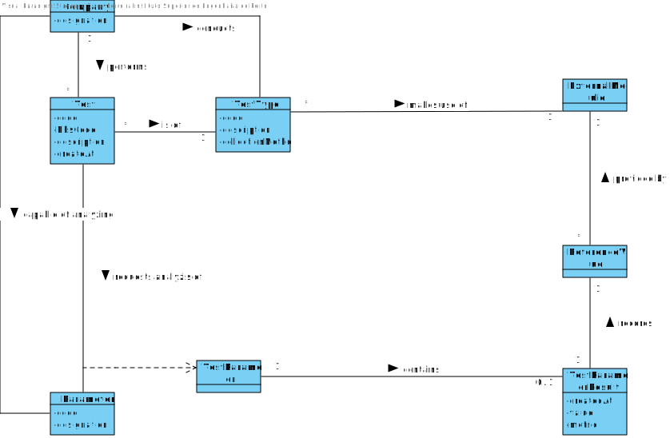
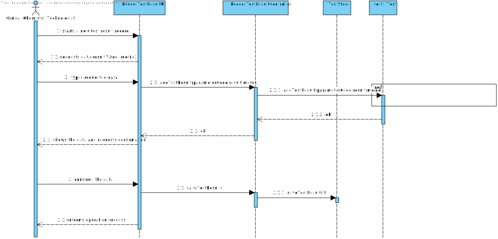
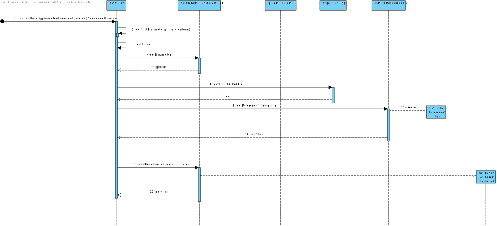
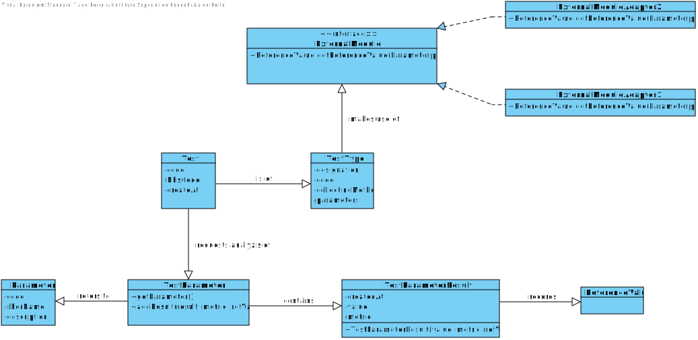

# US 012 - Record Tests Result

## 1. Requirements Engineering

*In this section, it is suggested to capture the requirement description and specifications as provided by the client as well as any further clarification on it. It is also suggested to capture the requirements acceptance criteria and existing dependencies to other requirements. At last, identfy the involved input and output data and depicted an Actor-System interaction in order to fulfill the requirement.*

### 1.1. User Story Description

As a clinical chemistry technologist, I intend to record the results of a given test.

### 1.2. Customer Specifications and Clarifications 

*Insert here any related specification and/or clarification provided by the client together with **your interpretation**. When possible, provide a link to such specifications/clarifications.*

### 1.3. Acceptance Criteria

**AC1:** The application should use an external module that is responsible
for providing the test reference values. The application can use an external module for
each type of test.

**AC2:** For instance, when the results are for blood tests parameters, the
externalmodule BloodReferenceValues1API can be used. When the results are for
Covid-19 tests parameters, the external module CovidReferenceValues1API can be used.

**AC3:** In any case, the API request should include, at most: (i) a key to access the module (e.g.:
“KEY1234”); (ii) a parameter identifier; (iii) the reference date; and (iv) reference
measurement unit (e.g. "mg").

### 1.4. Found out Dependencies

*Identify here any found out dependency to other US and/or requirements.*

### 1.5 Input and Output Data

**Input Data:** Acces Key, Parameter Indetifier, Reference Date, Reference Measurement Unit, TestTypes.

### 1.6. System Sequence Diagram (SSD)

*Insert here a SSD depicting the envisioned Actor-System interactions and throughout which data is inputted and outputted to fulfill the requirement. All interactions must be numbered.*

### 1.7 Other Relevant Remarks

*Use this section to capture other relevant information that is related with this US such as (i) special requirements ; (ii) data and/or technology variations; (iii) how often this US is held.* 

## 2. OO Analysis

### 2.1. Relevant Domain Model Excerpt 
*In this section, it is suggested to present an excerpt of the domain model that is seen as relevant to fulfill this requirement.* 

### 2.2. Other Remarks

*Use this section to capture some aditional notes/remarks that must be taken into consideration into the design activity. In some case, it might be usefull to add other analysis artifacts (e.g. activity or state diagrams).* 

## 3. Design - User Story Realization 

### 3.1. Rationale

**The rationale grounds on the SSD interactions and the identified input/output data.**

| Interaction ID | Question: Which class is responsible for... | Answer  | Justification (with patterns)  |
|:-------------  |:--------------------- |:------------|:---------------------------- |
| Step 1  		 |							 |             |                              |
| Step 2  		 |							 |             |                              |
| Step 3  		 |							 |             |                              |
| Step 4  		 |							 |             |                              |
| Step 5  		 |							 |             |                              |
| Step 6  		 |							 |             |                              |              

### Systematization ##

According to the taken rationale, the conceptual classes promoted to software classes are: 

 * Class1
 * Class2
 * Class3

Other software classes (i.e. Pure Fabrication) identified: 
 * xxxxUI  
 * xxxxController

## 3.2. Sequence Diagram (SD)

*In this section, it is suggested to present an UML dynamic view stating the sequence of domain related software objects' interactions that allows to fulfill the requirement.* 

ref:

## 3.3. Class Diagram (CD)

*In this section, it is suggested to present an UML static view representing the main domain related software classes that are involved in fulfilling the requirement as well as and their relations, attributes and methods.*

# 4. Tests 
*In this section, it is suggested to systematize how the tests were designed to allow a correct measurement of requirements fulfilling.* 

**_DO NOT COPY ALL DEVELOPED TESTS HERE_**

**Test 1:** Check that it is not possible to create an instance of the Example class with null values. 

	@Test(expected = IllegalArgumentException.class)
		public void ensureNullIsNotAllowed() {
		Exemplo instance = new Exemplo(null, null);
	}

*It is also recommended to organize this content by subsections.* 

# 5. Construction (Implementation)

*In this section, it is suggested to provide, if necessary, some evidence that the construction/implementation is in accordance with the previously carried out design. Furthermore, it is recommeded to mention/describe the existence of other relevant (e.g. configuration) files and highlight relevant commits.*

*It is also recommended to organize this content by subsections.* 

**Test Class**

    public class Test{

    private TestType tt;    
    private TestParameter testP;

    private String code;
    private long NhsCode;
    private String createdAt;
    

    public Test(String code, long NhsCode, String createdAt){
        
    this.code = code;
    this.NhsCode = NhsCode;
    this.createdAt = createdAt;
    private long parameterCode;
    private String result;
    private String metric;
    private TestParameter tp;
    
    }

    
    public boolean addTestResult(long parameterCode, String result, String metric){
    
    Parameter referenceValue;
    long param = getParameter();
    ExternalModule em = tt.getExternalModule();
    Parameter referenceValue =  em.getReferenceValue(param);

    testP.addResult(result,metric,referenceValue);
    
    
    
    }

    public long getParameterFor(){
    return parameterCode;
    }
    
    public void addResult(String result, String metrinc, Parameter referenceValue){
    this.tp = new TestParameter(result,metric,referenceValue);
    }

    public void setParameterFor(long parameterFor){
    this.parameterCode = parameterFor;
    }

    }

**TestParameter:**

    public class TestParameter(){

    private String result;
    private String metric;
    private Parameter refValue;

    public TestParameter(String result, String metric, Parameter refValue){
    this.result = result;
    this.metric = metric;
    this.refValue = refValue;
    }

    
    
    }

**RecordTestResultController Class:**

    public class RecordTestResultController{
    
    private Test test;

    
    public boolean addTestResult(long parameterCode, String result, String metric){
    test.addTestResult(parameterCode,result,metric);
    }

    }

**TestType Class:**

    public class TestType extends SpecifyNewTestStore {

    private String code;
    private String description;
    private String collectingMethod;
    private ArrayList<ParameterCategory> parameterList;

    public TestType(String code, String description,String collectingMethod){
        this.code = code;
        this.description = description;
        this.collectingMethod = collectingMethod;
        private ExternalModule;
        parameterList = new ArrayList<ParameterCategory>();
    }

    public void setExternalModule(ExternalModule externalM){
    this.externalM = externalM
    }
    
    public ExternalModule getExternalMedule()    {
    return externalM;
    }

    private void checkMethod(String collectingMethod){
        if(collectingMethod.length() == 0)
            throw new IllegalArgumentException("Test type must at least have one collecting method");
    }

    private void checkCode(String code){
        if(code.length() == 0 || code.length() != 5 )
            throw new IllegalArgumentException("Code doesn't exist or doesn't have 5 alphanumeric numbers");
    }

    private void checkDescription(String description){
        if(description.length() > 15 || description.length() == 0)
            throw new IllegalArgumentException("Description doesn't exist or surpasses the 15 characters rule!");
    }

    private void checkCollectingMethod(String collectingMethod){
        if(collectingMethod.length() > 20 || collectingMethod.length() == 0)
            throw new IllegalArgumentException("Collecting Method doesn't exist or surpasses the 20 characters rule!");
    }
    public void setCateory(ParameterCategory parameter){
        parameterList.add(parameter);
    }
    }

**Interface ExternalModule**
    
    
    
    interface ExternalModule{

    public ReferenceValue getReferenceValue(Parameter param){
    return param;
    }

    }

**ExternalModuleAdapter1:**

    public class ExternalModule1 implements ExternalModule{

     public ReferenceValue getReferenceValue(Parameter param){
    return param;
    }
    }

**ExternalModuleAdapter2:**

        public class ExternalModule2 implements ExternalModule{

     public ReferenceValue getReferenceValue(Parameter param){
    return param;
    }
    }

# 6. Integration and Demo 

*In this section, it is suggested to describe the efforts made to integrate this functionality with the other features of the system.*

# 7. Observations

*In this section, it is suggested to present a critical perspective on the developed work, pointing, for example, to other alternatives and or future related work.*

