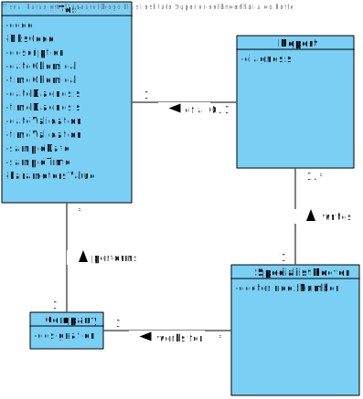
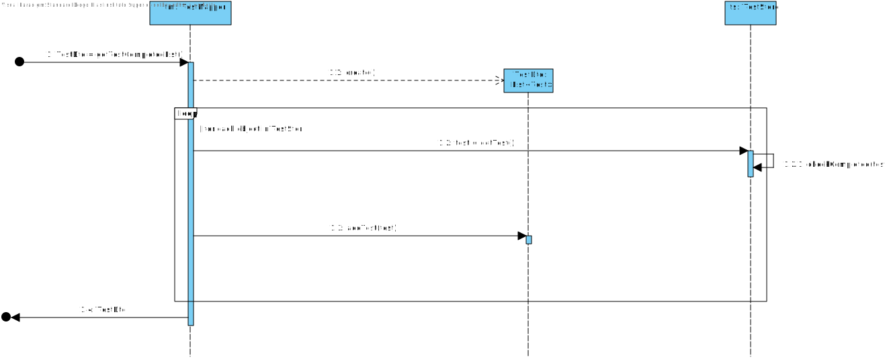

# US 14 - Make Diagnosis and Write Report

## 1. Requirements Engineering

*In this section, it is suggested to capture the requirement description and specifications as provided by the client as well as any further clarification on it. It is also suggested to capture the requirements acceptance criteria and existing dependencies to other requirements. At last, identfy the involved input and output data and depicted an Actor-System interaction in order to fulfill the requirement.*

### 1.1. User Story Description

*As a specialist doctor, I intend to make the diagnosis and write a report for a given test.*

### 1.2. Customer Specifications and Clarifications 

**From the Specifications Document:**

_"After completing the chemical analysis, the results of all chemical analyses are analysed by a
specialist doctor who makes a diagnosis and writes a report that afterwards will be delivered to the
client."_

_"After the specialist doctor has completed the diagnosis, the results of the clinical analyses and the
report become available in the system and must be validated by the laboratory coordinator"_

**From the client clarifications:**

* Q1: "Can you say the difference between the diagnosis and the report , what witch one should have and their roles in the project ? "

* A1: "I already answered this question in the last client meeting.
  The report contains the diagnosis. The report is free text."
  
* Q2: "Is there a limit of characters for the report and the diagnosis that will be made by the Specialist Doctor?"
* A2: "Yes, at most 400 words."

### 1.3. Acceptance Criteria

* AC1: Cannot deliver a Report with Diagnosis blank.
* AC2: Can only write reports about tests that have completed all previous steps.
* AC3: Report must have at most 400 words.

### 1.4. Found out Dependencies

This User Story is connected with the US15, regarding the validation of the report and diagnosis.
This User Story is connected with the US04, US05 and US12, regarding the information visualization by the Specialist Doctor. 

### 1.5 Input and Output Data

**Input Data**

* Typed data: Diagnosis (Text)

* Selected data: Select Test to write report

**Output Data**
* List of Tests Done

* (In)Success of the operation

### 1.6. System Sequence Diagram (SSD)

### 1.7 Other Relevant Remarks

## 2. OO Analysis

### 2.1. Relevant Domain Model Excerpt 

### 2.2. Other Remarks

Some Classes needed may not be represented in the Domain Model Excerpt presented, because they may not be represented in the main Domain Model.

## 3. Design - User Story Realization 

### 3.1. Rationale

**The rationale grounds on the SSD interactions and the identified input/output data.**

| Interaction ID | Question: Which class is responsible for... | Answer  | Justification (with patterns)  |
|:-------------  |:--------------------- |:------------|:---------------------------- |
| Step 1  : starts new Report	 |		...Interacting with the Specialist Doctor?  |      WriteReportUI      |Pure Fabrication|
| Step 1  : starts new Report	 |		...connecting the UI with the domain layer?   |      WriteReportController       |Controller - In order to have a good separation between the domain Layer and the UI Layer.|
| Step 1  : starts new Report	 |		...Creating the Report?   |      SpecialistDoctor -> ReportStore       |Based on the Creator standard (SpecialistDoctor used to store the list of all Reports ) on the MD, the responsibility is attributed to the SpecialistDoctor. By application of HC + LC in Company the responsibility is delegated to ReportStore|
| Step 2  : Shows list of Tests (Completed)	and Request Selection of Test	(t) |...Showing the list of tests?|TestMapper -> TestStore| DTO + IE - In order to maintain a HC and LC, the usage of a mapper to get the list of Test that correspond to the AC is required.|
| Step 3  : Select the test to write the report  		 |	...Creating the List?		 |  TestDto           |  DTO: Ensures the data transfer HC+LC                          |
| Step 3  : Select the test to write the report		 |...Selecting the Test?|TestMapper| IE: Has the list of all tests.
| Step 4  : shows the Test information and requests the Data (Diagnosis)  |...get the information?|Test|IE: Knows the information about itself. Tell don't ask!
| Step 4  : shows the Test information and requests the Data (Diagnosis)  |...Showing the information?|WriteReportController|IE: Knows the information to be visualized.
| Step 5  : Types Requested data		 |...saving the Input Data?|Report|IE: the object created in the first step has knowledge of its own data.
| Step 6  : shows data and requests Confirmation  |...validating the data according to AC?|Report|IE: Know its own creation rules.
| Step 7  : Confirms data		 |...saving the Report written?|SpecialistDoctor -> ReportStore |   Based on the IE standard (SpecialistDoctor used to store the list of all Reports ) on the MD, the responsibility is attributed to the SpecialistDoctor. By application of HC + LC in Company the responsibility is delegated to ReportStore.           
| Step 8  : informs operation success		 |...Informing?|WriteReportUI|      Pure Fabrication        

### Systematization ##

According to the taken rationale, the conceptual classes promoted to software classes are: 

* Company
* Test
* Report

Other software classes (i.e. Pure Fabrication) identified: 
* ReportStore
* TestMapper
* TestStore  
* WriteReportUI
* WriteReportController

## 3.2. Sequence Diagram (SD)

####Main

#### SD_TestMapper_TestDto_List

## 3.3. Class Diagram (CD)

# 4. Tests 
*In this section, it is suggested to systematize how the tests were designed to allow a correct measurement of requirements fulfilling.* 

**_DO NOT COPY ALL DEVELOPED TESTS HERE_**

# 5. Construction (Implementation)

*It is also recommended organizing this content by subsections.* 

* Company

    public class Company {
    /**
     * The designation of company.
     */
    private final String designation;

    /**
    * The store of Clinical Analysis Laboratory.
    */
    private ReportStore reportStore;

    /**
     * Return the Report's store.
     *
     * @return Report's store
     */
    public ReportStore getReportStore() {
        return this.reportStore;
    } 
    }

* Test
  

* Report

    public class Report {
    private String diagnosis;
    private Test test;

    Report (String diagnosis, Test test){
    this.diagnosis = diagnosis;
    this.test = test;

    }
    }

* ReportStore

    public class ReportStore {

    private ArrayList<Report> reportlist;

    public ReportStore(){
        reportlist = new ArrayList<>();
    }

    public Report createReport(String diagnosis, Test test){
        return new Report(diagnosis,test);
    }

    public boolean validateReport(Report report){
        if(report!=null) {
            if (!this.reportlist.isEmpty()) {
                for (Report temp : reportlist) {
                    if (temp.equals(report)) {
                        System.out.println("Report is not valid.");
                        return false;
                    }
                }
            }
            return true;
        }
        return false;
    }

    public boolean saveReport(Report report){
        if(!validateReport(report))
            return false;
        return this.reportlist.add(report);
    }
    }
  

* TestMapper
* TestStore
  

* WriteReportUI

  
    public class WriteReportUI {

    private WriteReportController writeReportController;
    private AuthFacade authFacade;

    /**
     * Constructor initiating the Controller and AuthFacade
     */
    public WriteReportUI()
    {
        this.writeReportController= new WriteReportController();
        this.authFacade = App.getInstance().getCompany().getAuthFacade();
    }
    }

* WriteReportController

    public class WriteReportController {
    private Company company;
    private Report report;
    private ReportStore reportStore;
    private TestMapper testMapper;
    private TestDto testdto;

    public WriteReportController(){
        this(App.getInstance().getCompany());
    }

    public WriteReportController(Company company){
        this.company = company;
        this.reportStore = company.getReportStore();
    }

    public boolean createReport(String diagnosis, Test test){
        report = reportStore.createReport(diagnosis, test);
        return reportStore.validateReport(report);
    }

    public boolean saveReport(){
        return this.reportStore.saveReport(report);
    }
    
    

    public TestMapper getTestCompletedList(){
        RolesMapper mapper = new RolesMapper();
        return testMapper.getTestCompletedList();
    }

    public boolean getTestInformation(Test test){
        return testMapper.getTestInformation(testdto.getTest(test));
    }
    }

# 6. Integration and Demo 

# 7. Observations

