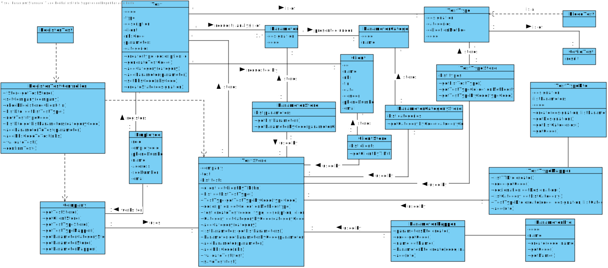

# US 4 - Register a Test

## 1. Requirements Engineering

*In this section, it is suggested to capture the requirement description and specifications as provided by the client as well as any further clarification on it. It is also suggested to capture the requirements acceptance criteria and existing dependencies to other requirements. At last, identfy the involved input and output data and depicted an Actor-System interaction in order to fulfill the requirement.*

### 1.1. User Story Description

*As a receptionist of the laboratory, I intend to register a test to be performed to a registered client.*

### 1.2. Customer Specifications and Clarifications 

**From the Specification Document:**

"...receptionist asks the client’s citizen card number, the lab order (which contains the type of test and parameters to be measured), and registers in the application the test to be performed to that client."

"Many Labs performs two types of tests. Each test is characterized by an internal code, an NHS code, a description that identifies the sample collection method, the date and time when the samples were collected, the date and time of the chemical analysis, the date and time of the diagnosis made by the specialist doctor, the date and time when the laboratory coordinator validated the test, and the test type (whether it is blood test or Covid test)." 

**From the client clarifications:**

Q1: When the receptionist chooses the test type, should the categories appear, and then when selecting the category, the receptionist can choose the parameters for the test? Or when the Receptionist chooses the test type, should appear all the parameters that it includes immediately?
A: Firstly, the receptionist should choose a test type. Then choose a category from a set of categories. Last, the receptionist should choose a parameter.

Q2:What are the attributes of a test and the acceptance criteria?
A: A test has the following attributes:
Test code : Sequential number with 12 digits. The code is automatically generated.
NHS code: 12 alphanumeric characters.

### 1.3. Acceptance Criteria

* AC1: : The receptionist must select the parameters to be analysed from all possible parameters in accordance with the test type.

### 1.4. Found out Dependencies
At least one:

Client needs to be registered in US3.

Receptionist needs to be registered in US7. 

Type of test needs to be specified in US9.

Parameter of the test needs to be specified in US10.

### 1.5 Input and Output Data

**Input Data:** CC number

**Selected Data:** TestType, Parameter(s)

**Output Data:** (in)sucess of the operation 

### 1.6. System Sequence Diagram (SSD)

*Insert here a SSD depicting the envisioned Actor-System interactions and throughout which data is inputted and outputted to fulfill the requirement. All interactions must be numbered.*

### 1.7 Other Relevant Remarks

* At least 1 Parameter Category needs to be created in the application.

* Receptionist needs to be logged in the application.

## 2. OO Analysis

### 2.1. Relevant Domain Model Excerpt 
*In this section, it is suggested to present an excerpt of the domain model that is seen as relevant to fulfill this requirement.* 

### 2.2. Other Remarks

*Use this section to capture some aditional notes/remarks that must be taken into consideration into the design activity. In some case, it might be usefull to add other analysis artifacts (e.g. activity or state diagrams).* 

## 3. Design - User Story Realization 

### 3.1. Rationale

**The rationale grounds on the SSD interactions and the identified input/output data.**

| Interaction ID | Question: Which class is responsible for... | Answer  | Justification (with patterns)  |
|:-------------  |:--------------------- |:------------|:---------------------------- |
| Step 1: asks to register a Test																|	...interacting with the user?							 				|  RegisterTestUI	|  	PureFabrication: responsible for user interaction                          |
| 																								|	...instantiating a new Test?						 					|  TestStore		|  	HC + LC                            |
| Step 2: requests Client citizen card number to associate the test 							|	n/a					 													|             		|                           |
| Step 3: types the CC number  																	|	...checking if Client is registered)									|  ClientStore		|  	HC + LC: Client is stored in ClientStore.                            |
|																								|	...saving the client?							 						|  TestStore		|  	HC + LC: Test is requested by Client.                            |
| Step 4: lists all the TestType and asks to select one											|	...listing all the TesType?												|  TestMapper 		|   DTO: TestTypeDto has the TestType list.                          |
| Step 5: selects the TestType  												 				|	...saving the TestType selected?						 				|  TestStore    	|  	HC + LC: Test is of TestType.                            |
| Step 6: lists all the parameter Categories and asks to select one								|	...listing all the ParameterCategory?									|  TestMapper 		|   DTO: TestTypeDto has the ParameterCategory list.                          |
| Step 7: selects the ParameterCategory  												 		|	...saving the ParameterCategory selected?						 		|  TestStore    	|  	HC + LC: Each TestType's Parameter is presented under ParameterCategory.                            |
| Step 6: shows list of Parameters and asks to choose at least one								|	...listing the Parameters?							 					|  TestMapper  		|   DTO: TestTypeDto has the list of the TestType's Parameters.                           |
| Step 7: selects the Parameter(s)  															|	...saving the list of Parameters selected?								|  TestStore    	|  	HC + LC: Test requests analysis of TestType.                            |
| Step 9: requests additional data ( nhsCode ) 													|	n/a						 												|               	|                              											|
| Step 10: types requested data  		 														|	...saving the input data?						 						|  TestStore    	|  	IE: Object created in step 1.                       				   |
| Step 11: validates and shows all the data, asking for confirmation  		 					|	...validating the data locally(eg.: mandatory vs non-mandatory data)?	|  Test		        |   IE: knows its own data.                         					 |
|   		 																					|	...validating the data globally(eg.: duplicated)?					 	|  TestStore	    |   HC+LC: knows all the Test objects.                         |
| Step 12: confirms all the data  		 														|	...saving the created Test												|  TestStore   		|   IE: adopts/records all the Test objects.                          |
| Step 13: informs Test registered to Client sucessfully  		 								|	...informing operation success?						 					|  RegisterTestUI	|   PureFabrication8: responsible for user interaction                          |              

### Systematization ##

According to the taken rationale, the conceptual classes promoted to software classes are: 

Client, TestType, Parameter, ParameterCategory, Test

Other software classes (i.e. Pure Fabrication) identified: 

registerTestUI (applying the "pure fabrication" pattern),
registerTestController (applying the "controller" pattern),
TestStore (HC+LC),
ClientStore (HC+LC),
ParameterCategoryStore(HC+LC)
TestMapper ("DTO" pattern),
ClientDTO ("DTO" pattern),
TestTypeDTO ("DTO" pattern)

## 3.2. Sequence Diagram (SD)

*In this section, it is suggested to present an UML dynamic view stating the sequence of domain related software objects' interactions that allows to fulfill the requirement.* 

*Main Diagram:*

*LabOrder_toDto Diagram:*

*TypeTestList_toDto Diagram:*

## 3.3. Class Diagram (CD)

*In this section, it is suggested to present an UML static view representing the main domain related software classes that are involved in fulfilling the requirement as well as and their relations, attributes and methods.*

# 4. Tests 
*In this section, it is suggested to systematize how the tests were designed to allow a correct measurement of requirements fulfilling.* 

**_DO NOT COPY ALL DEVELOPED TESTS HERE_**

**Test 1:** Check that it is not possible to create an instance of the Example class with null values. 

	@Test(expected = IllegalArgumentException.class)
		public void ensureNullIsNotAllowed() {
		Exemplo instance = new Exemplo(null, null);
	}

*It is also recommended to organize this content by subsections.* 

# 5. Construction (Implementation)

*In this section, it is suggested to provide, if necessary, some evidence that the construction/implementation is in accordance with the previously carried out design. Furthermore, it is recommeded to mention/describe the existence of other relevant (e.g. configuration) files and highlight relevant commits.*

*It is also recommended to organize this content by subsections.* 

# 6. Integration and Demo 

*In this section, it is suggested to describe the efforts made to integrate this functionality with the other features of the system.*

# 7. Observations

*In this section, it is suggested to present a critical perspective on the developed work, pointing, for example, to other alternatives and or future related work.*

