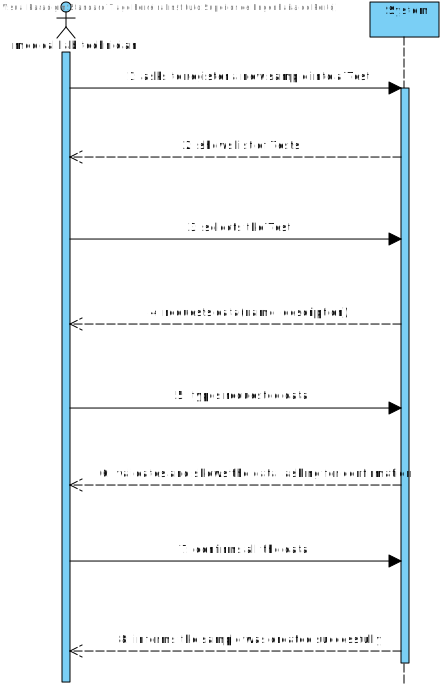
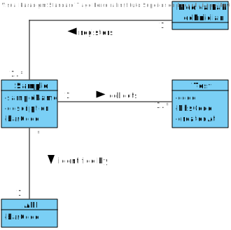
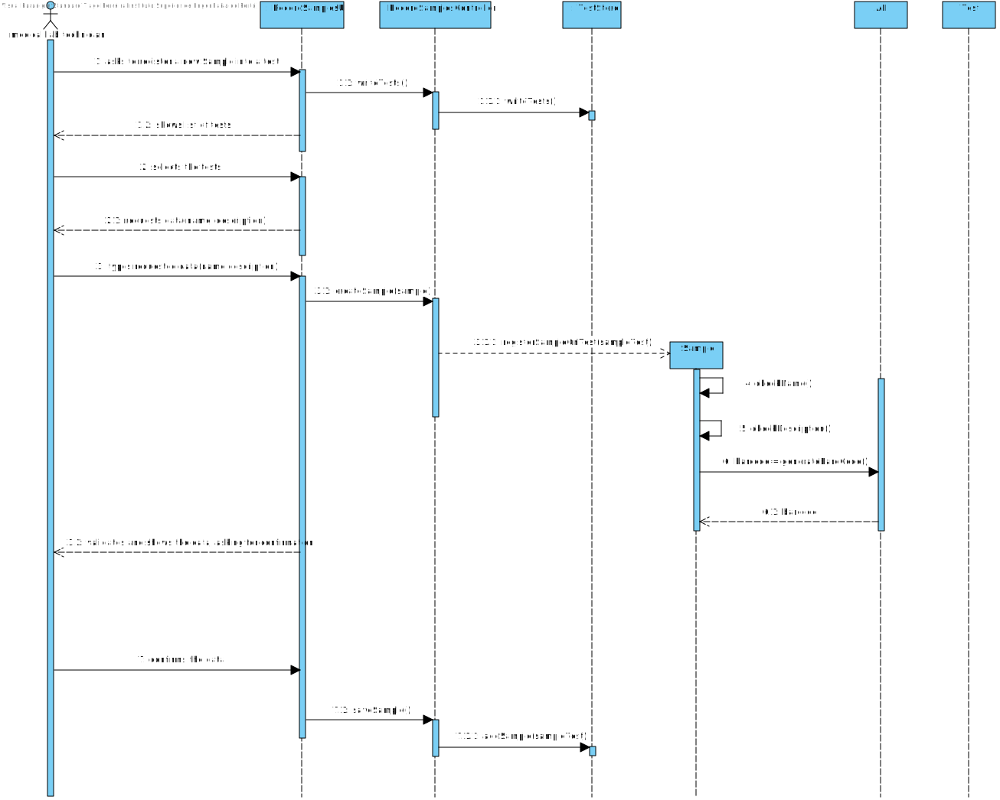

# US 5 - Record Samples

## 1. Requirements Engineering

*In this section, it is suggested to capture the requirement description and specifications as provided by the client as well as any further clarification on it. It is also suggested to capture the requirements acceptance criteria and existing dependencies to other requirements. At last, identfy the involved input and output data and depicted an Actor-System interaction in order to fulfill the requirement.*

### 1.1. User Story Description

As a medical lab technician, I want to record the samples collected in the scope of a
given test

### 1.2. Customer Specifications and Clarifications 

**Q1:** Why is there the specification for only the tests with no samples?

**A1:** The Medical Lab Technician selects a tests and the number of barcodes he/she wants. Then the system generates the requested barcodes.
After generating the barcodes, the select test is no more available in the system for generating barcodes.

**Q2:** What information does the medical lab technician needs to input to record a new sample?

**A2:** The medical lab technician checks a list of tests and selects one. Then, the application generates barcodes (one or more). After printing the barcodes (one or more) the use case ends.

**Q3:** What kind of attributes should a sample have?

**A3:** Each sample is associated with a test. A sample has only one attribute, a barcode number (UPC) that is a sequential number and is automatically generated by the system. Each sample has a unique barcode number.
In US5, the medical lab technician checks the system and see all tests for which there are no samples collected. The medical lab technician selects a test and the system asks for the number of samples to collect.

**Q4:** Can a test have more than one sample?
**A4:** Yes.

**Q5:** We didn't fully understand what will the API do in this US, so here's out interpretation from the US, correct us if we're wrong please: The API will be generated randomly and the API is an attribute from the sample.

**A5:** The API will be used to generate/print barcodes.

**Q6:** During the current sprint, how should we allow the barcodes to be printed. After generating them via the API, should we save the barcode images to the disk?

**A6:** Each generated barcode should be saved in a folder as a jpeg file.

### 1.3. Acceptance Criteria

**AC1:** The system should support several barcode APIs. The API to use is
defined by configuration.

**AC2:** The Sample should only have a barcode as an attribute

**AC3:** The barcode needs to be as a jpeg 

**AC4:** A Test can have more than one sample

### 1.4. Found out Dependencies

Dependencie on:

* US04, US07

### 1.5 Input and Output Data

Input data:
+ Number of Samples
+ Test selection

Output data:

+ Barcode;
+ Test's state changes into a sample registered

### 1.6. System Sequence Diagram (SSD)

*Insert here a SSD depicting the envisioned Actor-System interactions and throughout which data is inputted and outputted to fulfill the requirement. All interactions must be numbered.*

### 1.7 Other Relevant Remarks

*Use this section to capture other relevant information that is related with this US such as (i) special requirements ; (ii) data and/or technology variations; (iii) how often this US is held.* 

## 2. OO Analysis

### 2.1. Relevant Domain Model Excerpt 
*In this section, it is suggested to present an excerpt of the domain model that is seen as relevant to fulfill this requirement.* 

### 2.2. Other Remarks

*Use this section to capture some aditional notes/remarks that must be taken into consideration into the design activity. In some case, it might be usefull to add other analysis artifacts (e.g. activity or state diagrams).* 

## 3. Design - User Story Realization 

### 3.1. Rationale

**The rationale grounds on the SSD interactions and the identified input/output data.**

| Interaction ID | Question: Which class is responsible for... | Answer  | Justification (with patterns)  |
|:-------------  |:--------------------- |:------------|:---------------------------- |
| Step 1: asks the number of samples  		 |		...asking the user the number of samples?					 |     UI        |     UI: User Interface interacts with the user about an object information                         |
|   |  ...creating a new Sample |  TestStore | HC LC   |
| Step 2: shows list of Test  		 |	...showing the test  list?						 |    TestStore + TestMapper         |          IE: Knows the list of Test  DTO: Has the object list with its attributes                    |
| Step 3: selects the Test 		 |	n/a						 |             |                              |
| Step 4: requests sample data  		 |	n/a						 |             |                              |
| Step 5: inputs the data  		 |		...saving input data?					 |     TestStore        |         IE: knows Sample Object data                     |
| | ...generating sample's barcode? | API | Creator: generates an attribute for an Object | 
| Step 6: validates and shows the data, asking for confirmation  		 |		...validating the data?					 |    Sample         |        IE: knows it's own data                      |              
| Step 7: confirms all the data | ...saving the data? | TestStore | IE: records all the object data|
|Step 8: informs the sample was created successfully | ...informing the operation success to the user? | UI | UI: User Interface interacts with the user informing him about the operation|
### Systematization ##

According to the taken rationale, the conceptual classes promoted to software classes are: 

 * API
 * Test
* TestStore
 

Other software classes (i.e. Pure Fabrication) identified: 
 * RecordSampleUI  
 * RecordSamplesController
 * TestMapper

## 3.2. Sequence Diagram (SD)

*In this section, it is suggested to present an UML dynamic view stating the sequence of domain related software objects' interactions that allows to fulfill the requirement.* 

ref:

## 3.3. Class Diagram (CD)

*In this section, it is suggested to present an UML static view representing the main domain related software classes that are involved in fulfilling the requirement as well as and their relations, attributes and methods.*

# 4. Tests 
*In this section, it is suggested to systematize how the tests were designed to allow a correct measurement of requirements fulfilling.* 

**_DO NOT COPY ALL DEVELOPED TESTS HERE_**

**Test 1:** Check that it is not possible to create an instance of the Example class with null values. 

	@Test(expected = IllegalArgumentException.class)
		public void ensureNullIsNotAllowed() {
		Exemplo instance = new Exemplo(null, null);
	}

*It is also recommended to organize this content by subsections.* 

# 5. Construction (Implementation)

**TestDTO:**

    public class TestDTO{

    private String code;
    private Client client

    public TestDTO(String code, Client client){
    
    this.code = code;
    this.client = client;
    }

    public String getCode(){
    return code;
    }
    
    public Client getClient(){
    return Client
    }

    }

**TestStore:**

    public class TestStore{

      private List<Test> testS;

    public TestStore () {
        this.testS = new ArrayList<>();
    }

    public void addTestStore (Test test) {
        this.testS.add(test);
    }

     public List<Test> getTests () {
        if(testS!=null) {
            if (testS.isEmpty()) {
                throw new IllegalArgumentException("Organization Test list is empty.");
            }
            return testS;
        }
        return null;
    }

    public void addSampletoTest(Sample sample, Test test){
    
        for(Test t : testS){
        if(t == test)
        t.add(sample);
        }
    }

    }

**RecordSamplesController:**

    public class RecordSampleController {

    private final Company company;
    private final SampleStore sampleStore;
    private final TestStore testStore;
    private final ClientStore clientStore;
    private Sample sample;

    public RecordSampleController() {
        if (!App.getInstance().getCurrentUserSession().isLoggedInWithRole(ROLE_MED_LAB_TECH)) {
            throw new IllegalStateException("Access Unauthorized!");
        }
        this.company = App.getInstance().getCompany();
        this.sampleStore = this.company.getSampleStore();
        this.testStore = this.company.getTestStore();
        this.clientStore = this.company.getClientStore();
    }

    public Sample createSample(String id, String testCode) throws IOException, BarcodeException, OutputException {
        this.testStore.setTest(testCode);
        this.sample = this.sampleStore.createSample(id);
        return sample;
    }

    public boolean saveSample() {
        if(this.sampleStore.saveSample(this.sample)) {
            return this.testStore.addSampleToTest(sample);
        }
        System.out.println("\nSample is already registered in Test.");
        return false;
    }

    public List<TestDto> getTests() {
        List<Test> tests = this.testStore.getRegisteredTests();
        TestMapper mapper = new TestMapper();
        return mapper.toDto(tests);
    }

    public List<TestDto> listTestSamples() {
        List<Test> tests = this.testStore.getSampleCollectedTests();
        TestMapper mapper = new TestMapper();
        return mapper.testSamples_toDto(tests);
    }

**TestMapper:**

    public class TestMapper{

    
    public TestMapper(){

    }

    public List<TestDTO> toDto(List<testDTO>list){

    List<TestDto> testDto = new ArrayList<>();

    for(Test test: list){
    String code = test.getId();
    Client client = test.getClient();
    
    TestDTO dto = new TestDTO(code,client);

    testDTO.add(dto);
    }

    }
    }

**Sample:**

    public class Sample {

    private final Barcode sampleBarcode;
    private final String jpegPath;

    //AC: Sample should only have Barcode
    public Sample(String id) throws BarcodeException, OutputException, IOException {

        Random r = new Random();
        long numbers = r.nextInt(1_000_000_000)
                + (r.nextInt(90) + 10) * 1_000_000_000L;
        System.out.println(String.valueOf(numbers));

        this.sampleBarcode = BarcodeFactory.createCode128(String.valueOf(numbers));

        //Save as JPEG
        File barcodeJPEG = new File("samples/sample_"+id+"_"+ numbers+".jpeg");

        if (!barcodeJPEG.exists()){
            this.jpegPath = null;
        }else{
            this.jpegPath="Sample_" + id;
        }
        BarcodeImageHandler.saveJPEG(sampleBarcode, barcodeJPEG);

    }

    public Barcode getSampleBarcode(){
        return this.sampleBarcode;
    }

    }

**SampleAPI:**

    Interface API {

    public File getBarcode() throws IOException {

        long min = 100000000000l;
        long max = 999999999999l;

        long random_bar =  (long)Math.floor(Math.random()*(max-min+1)+min);

        String barcode = String.valueOf(random_bar);

        System.out.println(barcode);

        BufferedImage b = generateEAN13BarcodeImage(barcode);

        File file = new File("myimage.png");
        //ImageIO.write(b,"png",file);
        return file;
    }

    public static BufferedImage generateEAN13BarcodeImage(String barcodeText) {

        EAN13Bean barcodeGenerator = new EAN13Bean();
        BitmapCanvasProvider canvas =
                new BitmapCanvasProvider(160, BufferedImage.TYPE_BYTE_BINARY, false, 0);

        barcodeGenerator.generateBarcode(canvas, barcodeText);
        return canvas.getBufferedImage();
    }

    }

**SampleStore**

    public class SampleStore {

    private final List<Sample> sampleList;

    public SampleStore(){
        this.sampleList = new ArrayList<>();
    }

    public Sample createSample(String id) throws BarcodeException, OutputException, IOException {
        return new Sample(id);
    }

    public boolean saveSample(Sample sample){
        if(validateSample(sample))
            return this.sampleList.add(sample);
        else
            return false;
    }

    public boolean validateSample(Sample sample){
        for (Sample s : this.sampleList) {
            if (s.getSampleBarcode().equals(sample.getSampleBarcode())) return false;
        }
        return true;
    }
        
    public List<Sample> getSamples(){
        return this.sampleList;
    }
    }

# 6. Integration and Demo 

*In this section, it is suggested to describe the efforts made to integrate this functionality with the other features of the system.*

# 7. Observations

*In this section, it is suggested to present a critical perspective on the developed work, pointing, for example, to other alternatives and or future related work.*

