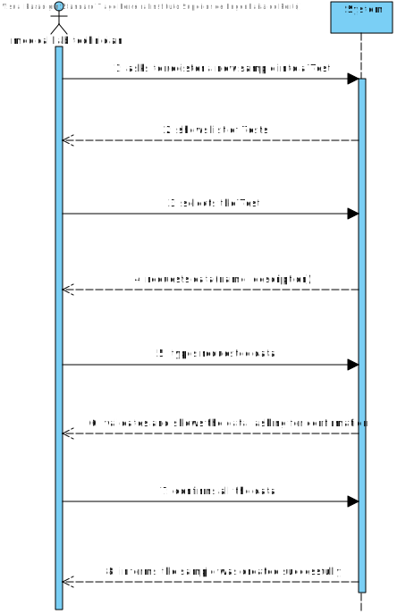
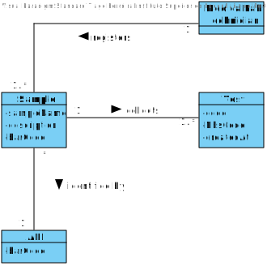

# US 5 - Record Samples

## 1. Requirements Engineering

*In this section, it is suggested to capture the requirement description and specifications as provided by the client as well as any further clarification on it. It is also suggested to capture the requirements acceptance criteria and existing dependencies to other requirements. At last, identfy the involved input and output data and depicted an Actor-System interaction in order to fulfill the requirement.*

### 1.1. User Story Description

As a medical lab technician, I want to record the samples collected in the scope of a
given test

### 1.2. Customer Specifications and Clarifications 

*Insert here any related specification and/or clarification provided by the client together with **your interpretation**. When possible, provide a link to such specifications/clarifications.*

### 1.3. Acceptance Criteria

**AC1:** The system should support several barcode APIs. The API to use is
defined by configuration.

### 1.4. Found out Dependencies

*Identify here any found out dependency to other US and/or requirements.*

### 1.5 Input and Output Data

Input data:
+ Sample Name;
+ Description;

Output data:
+ Barcode;

### 1.6. System Sequence Diagram (SSD)

*Insert here a SSD depicting the envisioned Actor-System interactions and throughout which data is inputted and outputted to fulfill the requirement. All interactions must be numbered.*

### 1.7 Other Relevant Remarks

*Use this section to capture other relevant information that is related with this US such as (i) special requirements ; (ii) data and/or technology variations; (iii) how often this US is held.* 

## 2. OO Analysis

### 2.1. Relevant Domain Model Excerpt 
*In this section, it is suggested to present an excerpt of the domain model that is seen as relevant to fulfill this requirement.* 

### 2.2. Other Remarks

*Use this section to capture some aditional notes/remarks that must be taken into consideration into the design activity. In some case, it might be usefull to add other analysis artifacts (e.g. activity or state diagrams).* 

## 3. Design - User Story Realization 

### 3.1. Rationale

**The rationale grounds on the SSD interactions and the identified input/output data.**

| Interaction ID | Question: Which class is responsible for... | Answer  | Justification (with patterns)  |
|:-------------  |:--------------------- |:------------|:---------------------------- |
| Step 1: asks to register a new sample into a test  		 |		...asking the user the sample attributes?					 |     UI        |     UI: User Interface interacts with the user about an object information                         |
|   |  ...creating a new Sample |  TestStore | HC LC   |
| Step 2: shows list of Test  		 |	...showing the test  list?						 |    TestStore + TestMapper         |          IE: Knows the list of Test  DTO: Has the object list with its attributes                    |
| Step 3: selects the Test 		 |	n/a						 |             |                              |
| Step 4: requests sample data  		 |	n/a						 |             |                              |
| Step 5: inputs the data  		 |		...saving input data?					 |     TestStore        |         IE: knows Sample Object data                     |
| | ...generating sample's barcode? | API | Creator: generates an attribute for an Object | 
| Step 6: validates and shows the data, asking for confirmation  		 |		...validating the data?					 |    Sample         |        IE: knows it's own data                      |              
| Step 7: confirms all the data | ...saving the data? | TestStore | IE: records all the object data|
|Step 8: informs the sample was created successfully | ...informing the operation success to the user? | UI | UI: User Interface interacts with the user informing him about the operation|
### Systematization ##

According to the taken rationale, the conceptual classes promoted to software classes are: 

 * API
 * Test
* TestStore
 

Other software classes (i.e. Pure Fabrication) identified: 
 * RecordSampleUI  
 * RecordSamplesController
 * TestMapper

## 3.2. Sequence Diagram (SD)

*In this section, it is suggested to present an UML dynamic view stating the sequence of domain related software objects' interactions that allows to fulfill the requirement.* 

ref:

## 3.3. Class Diagram (CD)

*In this section, it is suggested to present an UML static view representing the main domain related software classes that are involved in fulfilling the requirement as well as and their relations, attributes and methods.*

# 4. Tests 
*In this section, it is suggested to systematize how the tests were designed to allow a correct measurement of requirements fulfilling.* 

**_DO NOT COPY ALL DEVELOPED TESTS HERE_**

**Test 1:** Check that it is not possible to create an instance of the Example class with null values. 

	@Test(expected = IllegalArgumentException.class)
		public void ensureNullIsNotAllowed() {
		Exemplo instance = new Exemplo(null, null);
	}

*It is also recommended to organize this content by subsections.* 

# 5. Construction (Implementation)

*In this section, it is suggested to provide, if necessary, some evidence that the construction/implementation is in accordance with the previously carried out design. Furthermore, it is recommeded to mention/describe the existence of other relevant (e.g. configuration) files and highlight relevant commits.*

*It is also recommended to organize this content by subsections.* 

# 6. Integration and Demo 

*In this section, it is suggested to describe the efforts made to integrate this functionality with the other features of the system.*

# 7. Observations

*In this section, it is suggested to present a critical perspective on the developed work, pointing, for example, to other alternatives and or future related work.*

