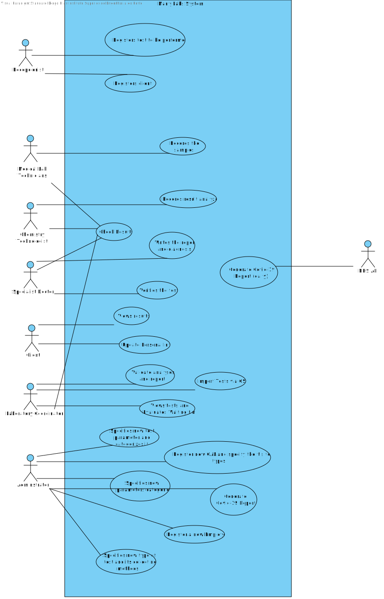

# Use Case Diagram (UCD)

**In the scope of this project, there is a direct relationship of _1 to 1_ between Use Cases (UC) and User Stories (US).**

However, be aware, this is a pedagogical simplification. On further projects and curricular units might also exist _1 to N **and/or** N to 1 relationships between US and UC.

**Insert below the Use Case Diagram in a SVG format**

**For each UC/US, it must be provided evidences of applying main activities of the software development process (requirements, analysis, design, tests and code). Gather those evidences on a separate file for each UC/US and set up a link as suggested below.**

# Use Cases / User Stories
| UC/US  | Description                                                               |                   
|:----|:------------------------------------------------------------------------|
| US1 | [View Results](US1/US1.md)   |
| US2 | [Evaluates Waiting Time](US2/US2.md)|
| US3 | [Register Client](US3/US3.md)|*
| US4 | [Register Test](US4/US4.md) |*
| US5 | [Records Samples](US5/US5.md)|*
| US6 | [Generate Covid-19 Reports](US6/US6.md)|
|US7|[Register New Employee](US7/US7.md)|*
|US8|[Register New CAL, with tests it performs](US8/US8.md)|*
|US9|[Specify New Test-Type](US9/US9.md)|*
|US10|[Specify New Parameter and Categorize it](US10/US10.md)|*
|US11|[Specify New Parameter Category](US11/US11.md)|*
|US12|[Records Results Analysis](US12/US12.md)|*
|US13|[Verifies the tests](US13/US13.md)|
|US14|[Write Report and Diagnosis](US14/US14.md)|*
|US15|[Validate Analysis and Report](US15/US15.md)|*
|US16|[Checks Results](US16/US16.md)|
|US17|[Import via CSV file](US17/US17.md)|
| ... | ...|
| USXX | [ShortNameOfUSXX](USXX/USXX.md)|
