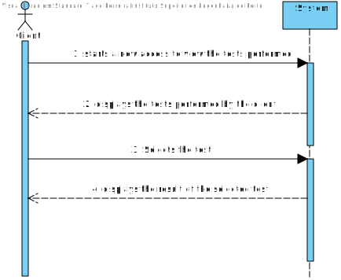
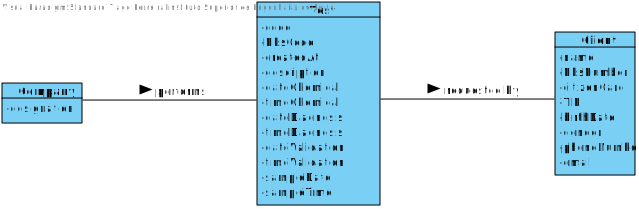

  # US 01 - View Test Results

## 1. Requirements Engineering

*In this section, it is suggested to capture the requirement description and specifications as provided by the client as well as any further clarification on it. It is also suggested to capture the requirements acceptance criteria and existing dependencies to other requirements. At last, identfy the involved input and output data and depicted an Actor-System interaction in order to fulfill the requirement.*

### 1.1. User Story Description

As a client, I want to access the application to view the results of the tests I have
performed.

### 1.2. Customer Specifications and Clarifications

**Q1:** In US01 which date should be used to arrange the tests in order?The date the test is done or the validation date?

**A1:** The test registration date.

### 1.3. Acceptance Criteria

**AC1:** The client tests must be shown ordered from the most
recent to the oldest one. The test results are shown only after the client has
selected a test.

**AC2:** The tests should be ordered by their registration date.

### 1.4. Found out Dependencies

**US3, US4**

### 1.5 Input and Output Data

**Input data:**

* Client log in:

    * Email
    * Password

* The option to access the Tests that the client performed.

**Output data:**

* The performed tests by the client.

### 1.6. System Sequence Diagram (SSD)

*Insert here a SSD depicting the envisioned Actor-System interactions and throughout which data is inputted and outputted to fulfill the requirement. All interactions must be numbered.*

### 1.7 Other Relevant Remarks

*Use this section to capture other relevant information that is related with this US such as (i) special requirements ; (ii) data and/or technology variations; (iii) how often this US is held.*

## 2. OO Analysis

### 2.1. Relevant Domain Model Excerpt
*In this section, it is suggested to present an excerpt of the domain model that is seen as relevant to fulfill this requirement.*

### 2.2. Other Remarks

*Use this section to capture some aditional notes/remarks that must be taken into consideration into the design activity. In some case, it might be usefull to add other analysis artifacts (e.g. activity or state diagrams).*

## 3. Design - User Story Realization

### 3.1. Rationale

**The rationale grounds on the SSD interactions and the identified input/output data.**

| Interaction ID | Question: Which class is responsible for... | Answer  | Justification (with patterns)  |
|:-------------  |:--------------------- |:------------|:---------------------------- |
| Step 1: starts a new access to view the tests performed?  		 |	Displaying the option to view the tests performed?						 | UI            |   UI: User interface interacts with the User actions.                           |
| Step 2: displays the tests performed by the client ? 		 |		Search for the client's performed tests?					 |  TestStore           |       IE: Knows it's own data                       |
| | Display the performed tests to the client? | UI | UI: User interface interacts with the user actions
| Step 3: Selects the Test  		 |	Sending the inputted data to the program?						 |    UI         |                              |
| Step 4: Displays the result of the selected test  		 |		Showing the selected Test? 					 |          TestStore   |       IE: Knows It's own data                       |

### Systematization ##

According to the taken rationale, the conceptual classes promoted to software classes are:

* Test
* Client

Other software classes (i.e. Pure Fabrication) identified:
* TestStore

## 3.2. Sequence Diagram (SD)

*In this section, it is suggested to present an UML dynamic view stating the sequence of domain related software objects' interactions that allows to fulfill the requirement.*

## 3.3. Class Diagram (CD)

*In this section, it is suggested to present an UML static view representing the main domain related software classes that are involved in fulfilling the requirement as well as and their relations, attributes and methods.*

# 4. Tests
*In this section, it is suggested to systematize how the tests were designed to allow a correct measurement of requirements fulfilling.*

**_DO NOT COPY ALL DEVELOPED TESTS HERE_**

**Test 1:** Check that it is not possible to create an instance of the Example class with null values.

	@Test(expected = IllegalArgumentException.class)
		public void ensureNullIsNotAllowed() {
		Exemplo instance = new Exemplo(null, null);
	}

*It is also recommended to organize this content by subsections.*

# 5. Construction (Implementation)

*In this section, it is suggested to provide, if necessary, some evidence that the construction/implementation is in accordance with the previously carried out design. Furthermore, it is recommeded to mention/describe the existence of other relevant (e.g. configuration) files and highlight relevant commits.*

*It is also recommended to organize this content by subsections.*

# 6. Integration and Demo

*In this section, it is suggested to describe the efforts made to integrate this functionality with the other features of the system.*

# 7. Observations

*In this section, it is suggested to present a critical perspective on the developed work, pointing, for example, to other alternatives and or future related work.*

