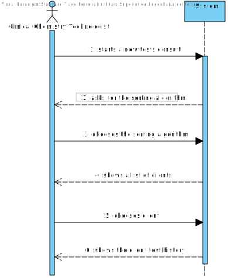
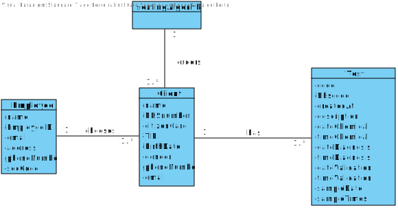
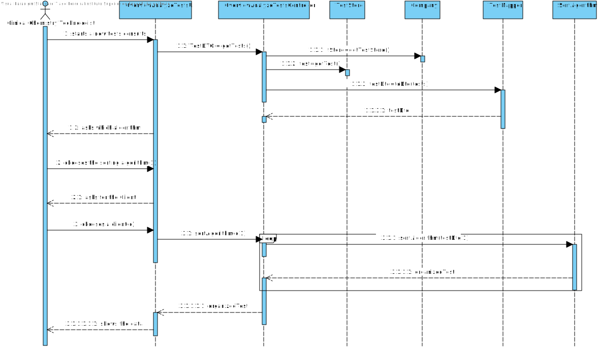
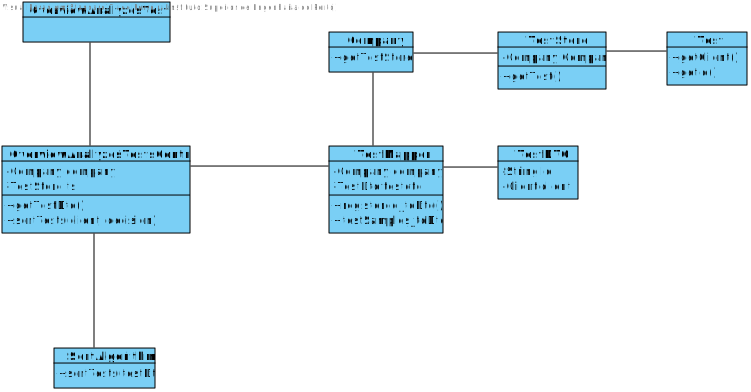

# US 01 - View Test Results

## 1. Requirements Engineering

*In this section, it is suggested to capture the requirement description and specifications as provided by the client as well as any further clarification on it. It is also suggested to capture the requirements acceptance criteria and existing dependencies to other requirements. At last, identfy the involved input and output data and depicted an Actor-System interaction in order to fulfill the requirement.*

### 1.1. User Story Description

As a clinical chemistry technologist, I intend to consult the historical tests
performed by a particular client and to be able to check tests details/results.

### 1.2. Customer Specifications and Clarifications 

Q1: The client's tests, that we have to show on this US, need to have been validated by the lab coordinator or is it enough if they just have results and we can show them before being validated by the lab coordinator?

A1: The tests to be presented in US13 are tests that have already been validated by the lab coordinator.

Q2: In US13, the Clinical Chemistry Technologist, can select more than one client at once to view its historical test results?

A2: No.

Q3: Moreover, will all the tests associated with the client be displayed or the clinical chemistry technologist will have also to select the tests he wants to see?

A3: After selecting one client, the application should show all the historical test results, of that client, to the Clinical Chemistry Technologist.

### 1.3. Acceptance Criteria

**AC1:** The application must allow ordering the clients by TIN and
by name to help the clinical chemistry technologist choose the target client. The
ordering algorithm to be used by the application must be defined through configuration file. At least two sorting algorithms should be available.

### 1.4. Found out Dependencies

**US7, US4**

### 1.5 Input and Output Data

**Input data:**

* Ordering algorithm selection

* Client TIN or Client Name (depending on what sorting algorithm the employee chooses)

**Output data:**

* The performed tests by the client.

### 1.6. System Sequence Diagram (SSD)

*Insert here a SSD depicting the envisioned Actor-System interactions and throughout which data is inputted and outputted to fulfill the requirement. All interactions must be numbered.*

### 1.7 Other Relevant Remarks

*Use this section to capture other relevant information that is related with this US such as (i) special requirements ; (ii) data and/or technology variations; (iii) how often this US is held.* 

## 2. OO Analysis

### 2.1. Relevant Domain Model Excerpt 
*In this section, it is suggested to present an excerpt of the domain model that is seen as relevant to fulfill this requirement.* 

### 2.2. Other Remarks

*Use this section to capture some aditional notes/remarks that must be taken into consideration into the design activity. In some case, it might be usefull to add other analysis artifacts (e.g. activity or state diagrams).* 

## 3. Design - User Story Realization 

### 3.1. Rationale

**The rationale grounds on the SSD interactions and the identified input/output data.**

| Interaction ID | Question: Which class is responsible for... | Answer  | Justification (with patterns)  |
|:-------------  |:--------------------- |:------------|:---------------------------- |
| Step 1  		 |		asking the client the which sorting algorithm?					 |   UI          |  UI                            |
| Step 2  		 |		asking the client which Client?					 |     UI        |   UI                           |
| | Organizing the tests? | Store | IE
| Step 3  		 |		sorting the clients?					 |    SortAlgorithm         | IE                             |
         

### Systematization ##

According to the taken rationale, the conceptual classes promoted to software classes are: 

 * SortingAlgorithm

Other software classes (i.e. Pure Fabrication) identified: 
 * AnalyzeOverViewTestsUI  
 * AnalyzeOverViewController

## 3.2. Sequence Diagram (SD)

*In this section, it is suggested to present an UML dynamic view stating the sequence of domain related software objects' interactions that allows to fulfill the requirement.* 

## 3.3. Class Diagram (CD)

*In this section, it is suggested to present an UML static view representing the main domain related software classes that are involved in fulfilling the requirement as well as and their relations, attributes and methods.*

# 4. Tests 
*In this section, it is suggested to systematize how the tests were designed to allow a correct measurement of requirements fulfilling.* 

**_DO NOT COPY ALL DEVELOPED TESTS HERE_**

**Test 1:** Check that it is not possible to create an instance of the Example class with null values. 

	@Test(expected = IllegalArgumentException.class)
		public void ensureNullIsNotAllowed() {
		Exemplo instance = new Exemplo(null, null);
	}

*It is also recommended to organize this content by subsections.* 

# 5. Construction (Implementation)

*In this section, it is suggested to provide, if necessary, some evidence that the construction/implementation is in accordance with the previously carried out design. Furthermore, it is recommeded to mention/describe the existence of other relevant (e.g. configuration) files and highlight relevant commits.*

*It is also recommended to organize this content by subsections.* 

# 6. Integration and Demo 

*In this section, it is suggested to describe the efforts made to integrate this functionality with the other features of the system.*

# 7. Observations

*In this section, it is suggested to present a critical perspective on the developed work, pointing, for example, to other alternatives and or future related work.*

