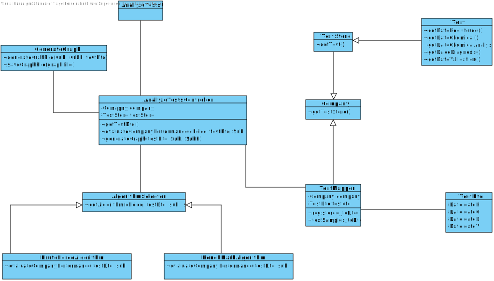

# US 16 - Overview and Analyze performed Tests

## 1. Requirements Engineering

### 1.1. User Story Description

**As a laboratory coordinator, I want to have an overview of all the tests performed  by Many Labs and analyse the overall performance of the company (for instance, check  the sub-intervals in which there were more samples waiting for the result). To facilitate  overall analysis, the application should also display statistics and graphs.**

### 1.2. Customer Specifications and Clarifications 

**Q1:** Should the interval of time considered for the evaluation be asked to the Laboratory Coordinator?

**A1:** Yes.

**Q2:**  How should we ask him the interval of time to be considered? Should we ask him to type a number of days? A number of weeks? Should we give general options like: last week, last month..., for him to select from? In case the Laboratory Coordinator chooses, for example, one week, should we consider the last 7 days, or should we consider, for example, the data from monday to sunday?

**A2:** The laboratory coordinator should introduce two dates that define an interval, the beginning date and the end date. This interval will be used to find the contiguous subsequence with maximum sum.

**Q3:** What is the meaning of "overview" here? Should the laboratory coordinator see the number of tests waiting for samples, the number of tests waiting for results, the number of tests waiting for diagnoses... Or should he see the information available for each one of the tests in the application?

**A3:** The laboratory coordinator should be able to check the number of clients, the number of tests waiting for results, the number of tests waiting for diagnosis and the total number of tests processed in the laboratory in each day, week, month and year. Moreover, the laboratory coordinator should be able to check the contiguous subsequence with maximum sum.

**Q4:** When you say tests waiting results are you referring to tests with samples collected but not analyzed yet? If so, and considering the csv file does not have an explicit date for when the sample is collected, which date should we use?

**A4:** Test_Reg_DateHour	Test_Chemical_DateHour	Test_Doctor_DateHour	Test_Validation_DateHour
Test Registered	Samples Analyzed	Diagnosis Made	Validated.

**Q5:** On the project description is written that "The algorithm to be used by the application must be defined through a configuration file", but on the requirements is written that "the laboratory coordinator should have the ability to dynamically select the algorithm to be applied from the ones available on the system". Should we discard the configuration file and add an option on th program to select one of the available algorithms?

**A5:** Developing an application, like the one we are developing during the Integrative Project, is a dynamic process and the best teams are those who are prepared to react to change quickly. Moreover, the latest client requests/requirements are those that should be considered. Typically, a client updates the requirements throughout the project development.

**Q6:** Regarding US16, when the laboratory coordinator "analyses the overall performance of the company", is the analysis purely looking at the results? Or should he write any type of report based on the results for the interval he is seeing?

**A6:** You should only identify the time interval where there was a delay in the response (the maximum subsequence).

**Q7:** Does the laboratory coordinator also select the amount of working hours per day? Or should we just consider it as 12 working hours/day?

**A7:** The lab coordinator does not select the amount of working hours per day. Please consider 12 working hours per day.

**Q8:** After the Laboratory Coordinator types the requested data and views the analysis of the company performance, should he be able to re-type different data and view the results for a different interval of time and/or algorithm? To make the re-type of the data easier, should there be a "clear" button, that is responsible for clearing the text fields for data entry?

**A8:** The laboratory coordinator should be able to explore different parameter values (settings) and check the results. Each team should prepare a simple and intuitive interface that requires a minimum number of interactions with the user.

### 1.3. Acceptance Criteria

**AC1:** While evaluating the performance the laboratory
coordinator should have the ability to dynamically select the algorithm to be
applied from the ones available on the system

**AC2:** Support for easily  adding other similar algorithms is required.

**AC3:** The application should also display statistics and graphs.

**AC4:** The laboratory coordinator should introduce two dates that define an interval, the beginning date and the end date. This interval will be used to find the contiguous subsequence with maximum sum.

**AC5:**  The application should always consider 12 working hours per day.

**AC6:** The laboratory coordinator should be able to explore different parameter values (settings) and check the results. 

**AC7:** Each team should prepare a simple and intuitive interface that requires a minimum number of interactions with the user.

### 1.4. Found out Dependencies

**US7:** As an administrator, I want to register a new employee.

**US4:** As a receptionist of the laboratory, I intend to register a test to be performed to a registered client.

### 1.5 Input and Output Data

**Input Data:**

* Introduce two dates that define an interval;
* Request the check the ManyLabs Test data;
* Selecting the algorithm to be applied.

**Output Data:**

* Overview of the tests performed;
* The performed tests statistics and graphs;
* The operation was successfully made warning;    

### 1.6. System Sequence Diagram (SSD)

*Insert here a SSD depicting the envisioned Actor-System interactions and throughout which data is inputted and outputted to fulfill the requirement. All interactions must be numbered.*

### 1.7 Other Relevant Remarks

*Use this section to capture other relevant information that is related with this US such as (i) special requirements ; (ii) data and/or technology variations; (iii) how often this US is held.* 

## 2. OO Analysis

### 2.1. Relevant Domain Model Excerpt 
*In this section, it is suggested to present an excerpt of the domain model that is seen as relevant to fulfill this requirement.* 

### 2.2. Other Remarks

*Use this section to capture some aditional notes/remarks that must be taken into consideration into the design activity. In some case, it might be usefull to add other analysis artifacts (e.g. activity or state diagrams).* 

## 3. Design - User Story Realization 

### 3.1. Rationale

**The rationale grounds on the SSD interactions and the identified input/output data.**

| Interaction ID | Question: Which class is responsible for... | Answer  | Justification (with patterns)  |
|:-------------  |:--------------------- |:------------|:---------------------------- |
    | Step 1: requests an analysis of the performed tests 		 |	...having the performed tests stored?|   Company         | IE: Has it's own data.                            |
| | ...sending the stored tests? | TestDTO | IE: Knows it's own data.
| Step 2: asks which algorithm should be used  		 |		...asking the user information?					 |    UI         |      UI: it's the frontier between the user and the system making it able to both interact.                        |
| Step 3: select the algorithm  		 |		...data inputs?					 |    UI        |     UI: The frontier between the user and the system making it able to both interact.|
| | ...selecting the inputted algorithm? | AlgorithmSelector | IE: Know's it's own data
| | ...generating the Algorithm | BruteForceAlgorithm/BenchmarkAlgorithm | Creator: generates a new algorithm |
| Step 4: requests for the subintervals |  ...data inputs? | UI | UI: The frontier between the user and the system making it able to both interact.|
| | ...generating the graphs? | CreateGraph | Creator: generates the graph|
| | ...evaluating the performance | GenerateGraphFile| IE: knows it's own data |
| Step 5: confirms the data 		 |	...Input the User selection?						 |  UI      |         UI: it's the frontier between the user and the system making it able to both interact.                             |
| Step 6: informs operation success  		 |	...converting the converted data into a file?						 |  GenerateGraphFile       |      IE: Has it's own data                        |              

### Systematization ##

According to the taken rationale, the conceptual classes promoted to software classes are: 

 * BenchmarkAlgorithm
 * CreateGraph
 * BruteForceAlgorithm
 * AlgorithmSelector

Other software classes (i.e. Pure Fabrication) identified: 
 * AnalyzeTestsUI  
 * AnalyzeTestsController
 * TestStore

## 3.2. Sequence Diagram (SD)

*In this section, it is suggested to present an UML dynamic view stating the sequence of domain related software objects' interactions that allows to fulfill the requirement.* 

ref:

## 3.3. Class Diagram (CD)

*In this section, it is suggested to present an UML static view representing the main domain related software classes that are involved in fulfilling the requirement as well as and their relations, attributes and methods.*

# 4. Tests 
*In this section, it is suggested to systematize how the tests were designed to allow a correct measurement of requirements fulfilling.* 

**_DO NOT COPY ALL DEVELOPED TESTS HERE_**

**Test 1:** Check that it is not possible to create an instance of the Example class with null values. 

	@Test(expected = IllegalArgumentException.class)
		public void ensureNullIsNotAllowed() {
		Exemplo instance = new Exemplo(null, null);
	}

*It is also recommended to organize this content by subsections.* 

# 5. Construction (Implementation)

*In this section, it is suggested to provide, if necessary, some evidence that the construction/implementation is in accordance with the previously carried out design. Furthermore, it is recommeded to mention/describe the existence of other relevant (e.g. configuration) files and highlight relevant commits.*

*It is also recommended to organize this content by subsections.* 

**OverviewAnalyzeTestController:**

    public class OverviewAnalyzeTestsController {

    private final Company company;
    private final ClientStore cs;
    private final TestStore ts;

    public OverviewAnalyzeTestsController(){
        this.company = App.getInstance().getCompany();
        this.cs = this.company.getClientStore();
        this.ts = this.company.getTestStore();
    }

    public List <ClientDTO> getClient() {
        List<Client> client = this.cs.getClientList();
        ClientMapper mapper = new ClientMapper();
        return mapper.toDto(client);
    }

    public List<Test> listClientTest(ClientDTO dto){

        Client c = cs.getClientByTIN(dto.getTin());
        List<Test> tl = new ArrayList<>();

        for(Test t : ts.getValidatedTests()){

            if(t.getClient().getName().equalsIgnoreCase(c.getName())){
                tl.add(t);
            }
        }

        return tl;
    }

**OverviewAnalyzeTestController:**

    public class OverviewAnalyzeTestsUI implements Runnable {

    OverviewAnalyzeTestsController oc;

    public OverviewAnalyzeTestsUI() {
        this.oc = new OverviewAnalyzeTestsController();

    }

    @Override
    public void run() {
        Scanner read = new Scanner(System.in);
        int choice;

        System.out.println("Which order algorithm? \nBy Name: 1\nBy TIN: 2");
        choice = read.nextInt();
        ClientDTO dto = writeClients(choice);
        System.out.println(dto);
        List <Test> tl = oc.listClientTest(dto);

        System.out.println("Validated tests by this client:"+dto+"\n");
        if(tl.isEmpty())
            System.out.println("\nNone");
        else {
            for (Test t : tl)
                System.out.println("\n" + t);
        }

    }

    public ClientDTO writeClients(int choice){

        List <ClientDTO> clientsDTOs = oc.getClient();

        if(choice == 1) {
            Collections.sort(clientsDTOs, new SortAlgorithm.ClientCompareByName());
        } else Collections.sort(clientsDTOs, new SortAlgorithm.ClientCompareByTIN());

        int index = Utils.showAndSelectIndex(clientsDTOs,"\nClients");

        if(index == 1) return null;
        return clientsDTOs.get(index);
    }
    }

**GraphGenerator:**

     public void radioListBy(ActionEvent event){

        if(rbtName.isSelected()){
            Collections.sort(clientsDTOs, new SortAlgorithm.ClientCompareByName());
            rbtTin.setSelected(false);

        }
        if(rbtTin.isSelected()){
            Collections.sort(clientsDTOs, new SortAlgorithm.ClientCompareByTIN());
            rbtName.setSelected(false);
        }

        for(int i=0; i<clientsDTOs.size();i++){
            myListView.getItems().set(i,clientsDTOs.get(i).toStringNameAndTIN());
        }

     @Override
    public void setInstance(Main mainInstance) {
        this.mainInstance=mainInstance;
    }

    public Stage stage;

    public Initializable generateGraph() throws Exception {
        this.stage = new Stage();
        stage.setTitle("Many Labs");
        stage.setMinWidth(MINIMUM_WINDOW_WIDTH-40);
        stage.setMinHeight(MINIMUM_WINDOW_HEIGHT-90);

        String fxml = "/fxml/OverviewClientTestsGUI.fxml";
        FXMLLoader loader = new FXMLLoader();

        InputStream in = Main.class.getResourceAsStream(fxml);
        loader.setBuilderFactory(new JavaFXBuilderFactory());
        loader.setLocation(App.class.getResource(fxml));

        Pane page;
        try {

            page = loader.load(in);
        } finally {
            in.close();
        }

        Scene scene = new Scene(page, SCENE_WIDTH-40, SCENE_HEIGHT-90);
        scene.getStylesheets().add("/styles/Styles.css");
        OverviewClientTestsGUI ct = loader.getController();
        ct.setClientDTO(client);
        ct.setStage(stage);
        this.stage.setScene(scene);
        this.stage.sizeToScene();

        this.stage.show();

        return loader.getController();
    }
    }

# 6. Integration and Demo 

*In this section, it is suggested to describe the efforts made to integrate this functionality with the other features of the system.*

# 7. Observations

*In this section, it is suggested to present a critical perspective on the developed work, pointing, for example, to other alternatives and or future related work.*

