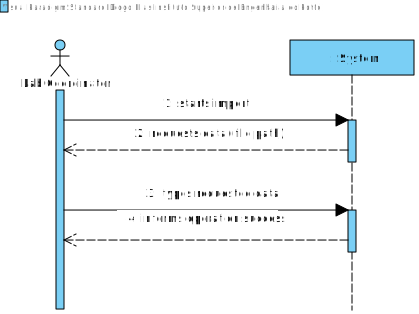
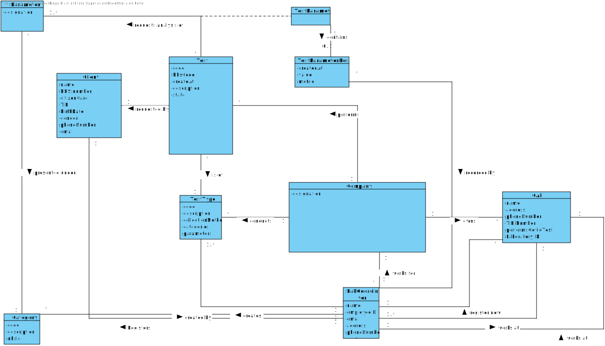
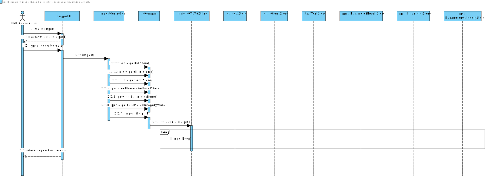
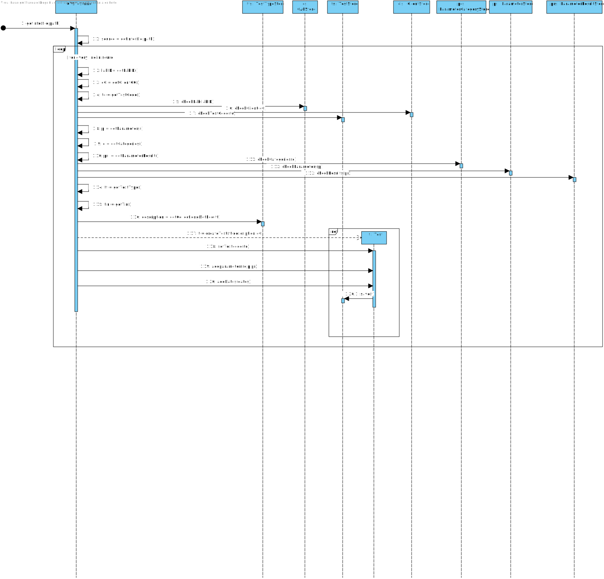
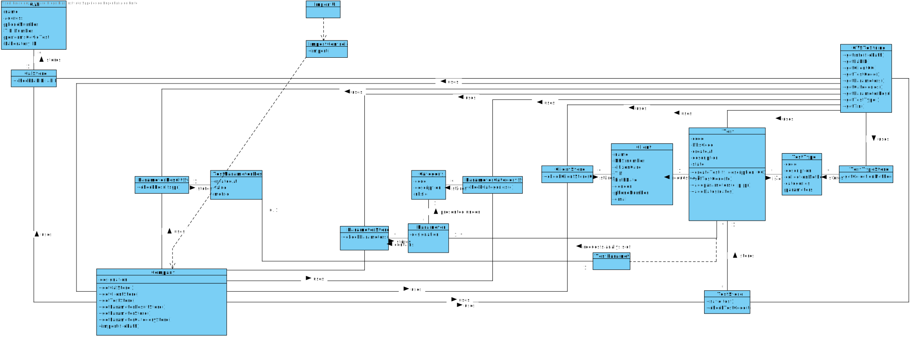

# US 17 - Import Clinical tests from CSV file

## 1. Requirements Engineering

### 1.1. User Story Description

*As a laboratory coordinator, I want to import clinical tests from a CSV file*

### 1.2. Customer Specifications and Clarifications 

**From the Specifications Document:**

_US17: As a laboratory coordinator, I want to import clinical tests from a CSV file.
Acceptance Criteria: If the file contains invalid data (e.g., a parameter not
defined in the system), that data should not be load into the system. An exception
should be thrown._

**From the client clarifications:**

* "Q1: In what folder should the CSV file be when we want to use the application through the console?
  
A: In this sprint each team should develop a graphical user interface. The file to import can be located in any folder. The user should specify the path of the file."
  

* "Q2: if a labID on the CSV file isn't found on the system, should we consider it "invalid data"?
  
A: Yes. To import tests of any laboratory (with a given Lab_ID), it is required that a laboratory having the given Lab_ID exists in the system.
  Therefore, if you want to import data from a given laboratory, you should use the application to create that laboratory in the system. Then you should import the data.

When creating a laboratory in the system, you should use the given Lab_ID (available in the CSV file) and define the other attributes using valid data. In this project, we are NOT going to import data from laboratories (or other entities) to reduce the amount of hours required to develop and deliver a working application to the client.

   What I say in this message is valid for the laboratories and for other entities that appear in the CSV files."

### 1.3. Acceptance Criteria

* AC1: The file to import can be located in any folder, the user should specify the path of the file.
* AC2: Cannot create any objects within the System through this import, except objects of Test.
* AC3: Thus, I shouldn't create a test with invalid data. Whether the data is from the test itself or from its associations (Laboratory, client, etc.). 

### 1.4. Found out Dependencies

* US3 - Register a new Client.
* US8 - Register a new Lab.
* US4 - Register a new Test.

US4 is the most relevant dependency because it has the working core of this US since a big part of this US is registering Tests. The other 2 US's are important because, as stated in the AC, we need valid Labs and valid Clients to register the imported tests. 

### 1.5 Input and Output Data

**Input data**

* Path of the file to be imported

**Output data**

* (In)Success of the operation
* Information of invalid input

### 1.6. System Sequence Diagram (SSD)

### 1.7 Other Relevant Remarks

The way these tests are created generates tests without samples. 

## 2. OO Analysis

### 2.1. Relevant Domain Model Excerpt 

### 2.2. Other Remarks

## 3. Design - User Story Realization 

### 3.1. Rationale

**The rationale grounds on the SSD interactions and the identified input/output data.**

| Interaction ID | Question: Which class is responsible for... | Answer  | Justification (with patterns)  |
|:-------------  |:--------------------- |:------------|:---------------------------- |
| Step 1  : starts import	 |	...Interacting with the Actor?	  |     ImportUI       |Pure Fabrication|
| Step 1  : starts import	 |	...Bridge between the UI and Domain Layer?	  | ImportController           |Controller|
| Step 2  : requests data (file path)	 |	n/a	  |            ||
| Step 3  : types requested data	 |...creates the import environment?	  |  LabCoordinator      |HC+LC:Because the actor responsible for this actions needs to be a user of our system we concluded that its better to attribute the responsability to this class. |            |
| Step 4  : shows information and requests confirmation		 |	...validate test information in file(system)?	  | TestStore           |IE:Knows all instances of tests.|
| Step 4  : shows information and requests confirmation		 |	...validate test information in file(locally)?	  | TestDto           |IE:Saves information of all tests before confirming with client|
| Step 4  : shows information and requests confirmation		 |	...validate clients information in file?	  | ClientStore           |IE: Knows all created instances of Clients|
| Step 5  : confirms the data		 |	...save tests information?	  | TestStore -> Test           |IE: The US to create test's is already done so this action after verifying that everything is right would be done with the help of those class's.|
| Step 6  : informs operation success	 |	...informing Actor?	  |   ImportUI         ||

### Systematization ##

According to the taken rationale, the conceptual classes promoted to software classes are: 

* LabCoordinator
* Test
* Company
* Client
* CAL
* TestType
* Parameter
* Category
* TestParameter
* TestParameterResult

Other software classes (i.e. Pure Fabrication) identified: 
* ImportUI
* ImportController
* TestDto
* TestStore
* ClientStore

## 3.2. Sequence Diagram (SD)

####Main

####Import Loop

####SaveLoop

## 3.3. Class Diagram (CD)

# 4. Tests 
*In this section, it is suggested to systematize how the tests were designed to allow a correct measurement of requirements fulfilling.* 

**_DO NOT COPY ALL DEVELOPED TESTS HERE_**

# 5. Construction (Implementation)

*It is also recommended organizing this content by subsections.* 

# 6. Integration and Demo 

# 7. Observations

Questions posed to client regarding every bit of operation of this US, either by our tem our by other teams. Waiting responses.

