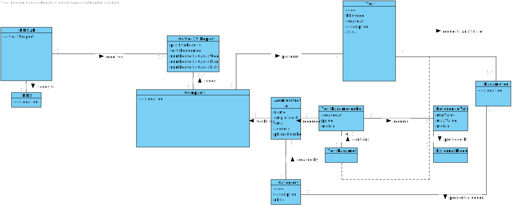
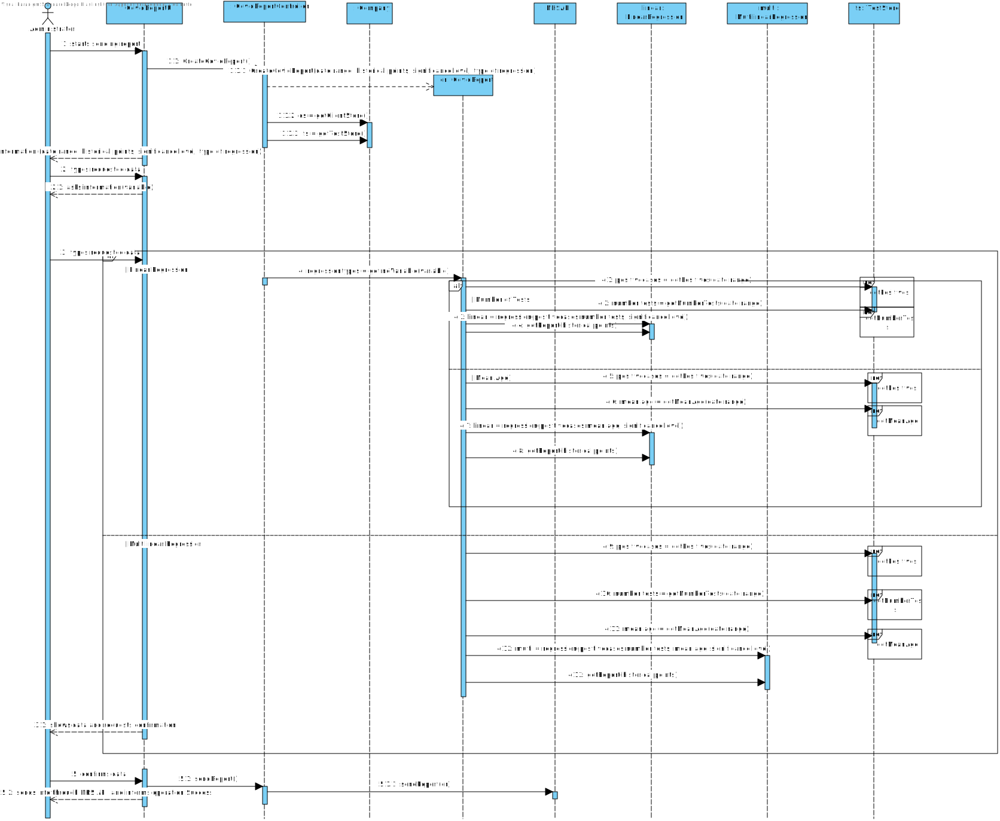
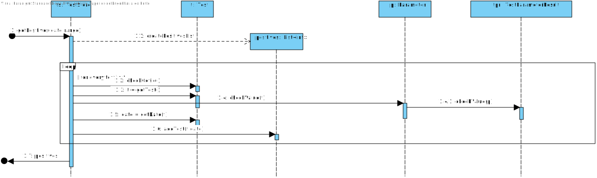
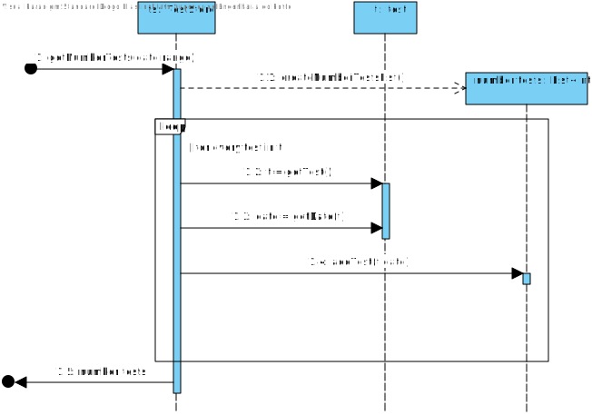
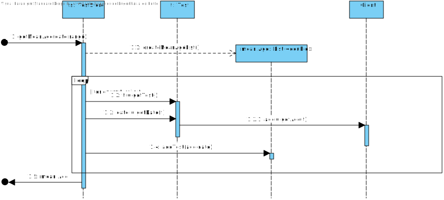
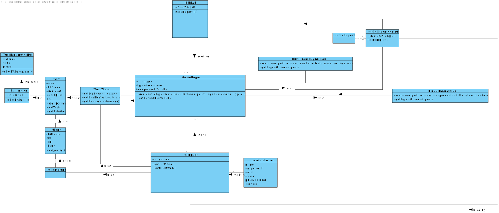

# US 18 - Send the Covid-19 report to the NHS at any time.

## 1. Requirements Engineering

### 1.1. User Story Description

*As an Administrator I want to send the Covid-19 report to the NHS at any time. I want to define the interval of dates to fit the regression model, the number of historical points (number of days or number of weeks) that must be sent to the NHS, the regression model to use and select the independent variables to use.*

### 1.2. Customer Specifications and Clarifications 

**From the Specifications Document:**

US18: As an Administrator I want to send the Covid-19 report to the NHS at any time. I want to define the interval of dates to fit the regression model, the number of historical points (number of days or number of weeks) that must be sent to the NHS, the regression model to use and select the independent variables to use.

Acceptance Criteria: The system should allow the Administrator to select
between a simple linear and multilinear regression model to fit the data.
Moreover, the Administrator should be able to choose the independent variable to use with the simple linear regression model (either the number of tests realized or the mean age). The system should send the report using the NHS API (available in moodle).

"...requires Many Labs to summarize and report Covid-19 data, the company
needs to:: identify the number of Covid-19 tests performed, identify all positive results to Covid-19
tests, report the total number of Covid-19 cases per day, per week and per month of the year, and
send the forecasts for these same time horizons (the number of Covid-19 cases for the following
day, next week and next month)."

"To make the predictions, the NHS contract defines that a linear regression algorithm should be used.
The NHS required that both simple linear and multiple linear regression algorithms should be
evaluated to select the best model. The accuracy of the prediction models should be analysed and
documented in the application user manual (in the annexes) that must be delivered with the
application. The algorithm to be used by the application must be defined through a configuration
file."

**From the client clarifications:**

* Q1: "In US18 you said " ..the number of historical points (number of days or number of weeks) that must be sent to the NHS .." what exactly is this ? Is this a interval of dates ?"
* A1:"Yes, you must allow the client to choose days of weeks."

* Q2:"If the admin selects the multilinear regression he/she can select more than one independent variable. Should he select from a checklist the ones that he/she want? If so, what are the supposed independent variables we need to include in the checklist?
From Sprint D requirements we also get "Administrator should be able to choose the independent variable to use with the simple linear regression model (either the number of tests realized or the mean age).""
* A2 : "to apply mlr you need two independent variables- daily number tests and mean age person tested daily. Also you need the same records per week."

* Q3: "which significance level should we use for the hypothesis tests?"
* A3: "The application should allow the user to choose the significance level."

### 1.3. Acceptance Criteria

* AC1: Admin must select between simple linear and multilinear regression model to fit the data. This should be defined with the help of a configuration file.
* AC2: Admin should choose 2 variables for the regression model (Number of tests or mean age of tested)
* AC3: Admin must select the dates for the report and the historical points.
* AC4: The system should send the report using the NHS API.
* AC5: The application should allow the user to choose the significance level.

### 1.4. Found out Dependencies

US19 - Executes the same instructions but with a specific schedule and data. This is configured via a configuration file.

### 1.5 Input and Output Data

**Input Data**

* Select Type of Regression .
  
* Select Independent Variables to be analysed.
  
* Select date range and Historical points.

* Select Significance Level.

**Output Data**

* Information regarding the Study of the Regression in use
* List of positive Covid-19 cases for the time selected
* List of Predictions of Positives cases according to the regression for the significance level selected
* List of Predictions of Positives cases according to the regression for the significance level selected in Intervals 
* (In)Success of the operation

### 1.6. System Sequence Diagram (SSD)

### 1.7 Other Relevant Remarks

## 2. OO Analysis

### 2.1. Relevant Domain Model Excerpt 

### 2.2. Other Remarks

## 3. Design - User Story Realization 

### 3.1. Rationale

**The rationale grounds on the SSD interactions and the identified input/output data.**

| Interaction ID | Question: Which class is responsible for... | Answer  | Justification (with patterns)  |
|:-------------  |:--------------------- |:------------|:---------------------------- |
| Step 1  : starts sending report	 |	...Interacting with Actor?  |    CovidReportUI        |Pure Fabrication|
| Step 1  : starts sending report	 |	...bridge between UI and Domain Layer?  |    CovidReportController        |Controller |
| Step 1  : starts sending report	 |	...starts Report?  |    CovidReport        |Creator : Records and agregates data from Covid Report|
| Step 2  : asks information (data range, historical points, significance level, types of regression)|	n/a |         ||
|Alternative(simples regression)|
---|
---|
---
| Step 3  : types requested data	 |		n/a  |             | |
| Step 4  : asks information (variable) |	n/a  |            ||
| Step 5  : types requested data	 |		...retrieves information - number of positives tests done for Date Range? |TestStore| IE: Knows all objects of Test
| Step 5  : types requested data	 |		...retrieves information - number of tests done for Date Range or number of mean age for Date Range? |TestStore -> ClientStore| IE: Knows all objects of Test and of Client
| Step 5  : types requested data	 |		...calculate linear regression?              |CovidReport ->LinearRegression| HC : To have less tasks associated with CovidReport and Specialization regarding the calculations requested.
|Alternative(Multilinear Regression)|
---|
---|
---
| Step 3  : types requested data	 |		...retrieves information - number of positives tests done for Date Range? |TestStore| IE: Knows all objects of Test
| Step 3  : types requested data	 |		...retrieves information - number of tests done for Date Range and number of mean age for Date Range? |TestStore -> ClientStore| IE: Knows all objects of Test and of Client
| Step 3  : types requested data	 |		...calculate multilinear regression?              |CovidReport ->MultilinearRegression| HC : To have less tasks associated with CovidReport and Specialization regarding the calculations requested.
| Step 6  : shows data and requests confirmation	 |	n/a	  |            ||
| Step 7  : confirms data	 |...show report?	  |      CovidReport      |IE|
| Step 7  : confirms data	 |...send info to NHS API?	  |    NHSAPI        ||
| Step 8  : sends info through NHS API and informs operation success|||

### Systematization ##

According to the taken rationale, the conceptual classes promoted to software classes are: 

* Administrator
* Company
* CovidReport
* NHSAPI
* Test

Other software classes (i.e. Pure Fabrication) identified: 
* CovidReportUI
* CovidReportController
* TestStore
* LinearRegression
* MultilinearRegression
* ClientStore

## 3.2. Sequence Diagram (SD)

####Main

#####List of Positives

#####List of Tests

#####List of Mean Age

## 3.3. Class Diagram (CD)

# 4. Tests 
*In this section, it is suggested to systematize how the tests were designed to allow a correct measurement of requirements fulfilling.* 

**_DO NOT COPY ALL DEVELOPED TESTS HERE_**

# 5. Construction (Implementation)

*It is also recommended organizing this content by subsections.* 

# 6. Integration and Demo 

# 7. Observations

