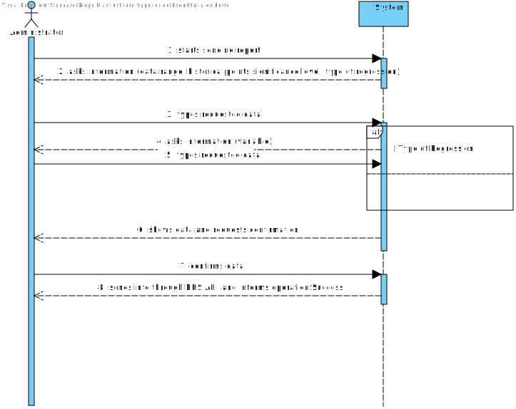

# US 18 - Send the Covid-19 report to the NHS at any time.

## 1. Requirements Engineering

### 1.1. User Story Description

*As an Administrator I want to send the Covid-19 report to the NHS at any time. I want to define the interval of dates to fit the regression model, the number of historical points (number of days or number of weeks) that must be sent to the NHS, the regression model to use and select the independent variables to use.*

### 1.2. Customer Specifications and Clarifications 

**From the Specifications Document:**

US18: As an Administrator I want to send the Covid-19 report to the NHS at any time. I want to define the interval of dates to fit the regression model, the number of historical points (number of days or number of weeks) that must be sent to the NHS, the regression model to use and select the independent variables to use.

Acceptance Criteria: The system should allow the Administrator to select
between a simple linear and multilinear regression model to fit the data.
Moreover, the Administrator should be able to choose the independent variable to use with the simple linear regression model (either the number of tests realized or the mean age). The system should send the report using the NHS API (available in moodle).

"...requires Many Labs to summarize and report Covid-19 data, the company
needs to:: identify the number of Covid-19 tests performed, identify all positive results to Covid-19
tests, report the total number of Covid-19 cases per day, per week and per month of the year, and
send the forecasts for these same time horizons (the number of Covid-19 cases for the following
day, next week and next month)."

"To make the predictions, the NHS contract defines that a linear regression algorithm should be used.
The NHS required that both simple linear and multiple linear regression algorithms should be
evaluated to select the best model. The accuracy of the prediction models should be analysed and
documented in the application user manual (in the annexes) that must be delivered with the
application. The algorithm to be used by the application must be defined through a configuration
file."

**From the client clarifications:**

### 1.3. Acceptance Criteria

* AC1: Admin must select between simple linear and multilinear regression model to fit the data. This should be defined with the help of a configuration file.
* AC2: Admin can use 2 variables for the regression model (Number of tests or mean age of tested)
* AC3: Admin must select the dates for the report and the historical points.

### 1.4. Found out Dependencies

### 1.5 Input and Output Data

**Input Data**

* Select Linear Regression, Select Variables to be analysed, Select dates and Historical points.

**Output Data**

* List of positive Covid-19 cases for the time frames(Day, week, month),List of Covid-19 tests performed at Many Labs for the time frames, List of Predictions for the time frames, Selection of Linear Regression to use
* (In)Success of the operation

### 1.6. System Sequence Diagram (SSD)

### 1.7 Other Relevant Remarks

## 2. OO Analysis

### 2.1. Relevant Domain Model Excerpt 

### 2.2. Other Remarks

## 3. Design - User Story Realization 

### 3.1. Rationale

**The rationale grounds on the SSD interactions and the identified input/output data.**

| Interaction ID | Question: Which class is responsible for... | Answer  | Justification (with patterns)  |
|:-------------  |:--------------------- |:------------|:---------------------------- |
| Step 1  : starts sending report	 |	...Interact with the Actor?	  |      CovidReportUI      |Pure Fabrication|
| Step 1  : starts sending report	 |	...Bridge between UI and Domain Layer?	  |   CovidReportController         |Pure Fabrication|
| Step 1  : starts sending report	 |	...creating the covid-19 report?	  |      Company -> CovidReportStore      |HC+LC:In order to send the report through the API, our team has chose to aggregate it on one block of information. That being said we conceptualized the record of the actions made by admin as an object (CovidReport). Company was the original responsible for this actions through the IE, Because it would know the information of every single object. With the HC+LC we choose the CovidReportStore to Store the objects and it's information.|
| Step 2  : asks date range to analyze and number of historical points|	n/a	  |            ||
| Step 3  : types requested data	 |	...verify if data range and historical points are valid?	  |     Date        | IE: knows the creation rule of its objects and valid states.|
| Step 3  : types requested data	 |	...verify if exists data for this data range?	  |     TestStore        | IE: knows all objects .|
| Step 3  : types requested data	 |	...verify if its possible to pin point the historical points requested?	  |     TestStore -> TestDto       | IE: Can validate if historical points can be calculated between date ranges .|
| Step 4  : asks type of regression and the variables to calculate |	n/a	  |            ||
| Step 5  : types requested data	 |		      ...Create CovidReport?        |CovidReport|Creator
| Step 5  : types requested data	 |		      ...List data by mean age?        |CovidReportStore|IE: 
| Step 5  : types requested data	 |		      ...List data by number of cases ?        |CovidReportStore|IE:
| Step 5  : types requested data	 |		      ...List all data ?        |CovidReportStore|IE
| Step 5  : types requested data	 |		      ...Calculate regression? |Matcp|Pure Fabrication : Due to the high complexity of the calculus needed, the creation of a new class to make them provides HC+LC and protection to any errors
| Step 5  : types requested data	 |		      ...Calculate predictions for the time frames required?        |Matcp|Pure Fabrication:
| Step 6  : shows data and requests confirmation	 |	n/a	  |            ||
| Step 7  : confirms data	 |...verify report is correct?	  |     CovidReport       |IE|
| Step 7  : confirms data	 |...save report?	  |      CovidReportStore      |IE|
| Step 7  : confirms data	 |...send info to NHS API?	  |    NHSAPI        ||
| Step 8  : sends info through NHS API and informs operation success	 |		  |            ||

### Systematization ##

According to the taken rationale, the conceptual classes promoted to software classes are: 

* Administrator
* Company
* CovidReport
* NHSAPI

Other software classes (i.e. Pure Fabrication) identified: 
* CovidReportUI
* CovidReportController
* CovidReportStore
* Date
* TestStore
* TestDto
* Matcp

## 3.2. Sequence Diagram (SD)

####Main

## 3.3. Class Diagram (CD)

# 4. Tests 
*In this section, it is suggested to systematize how the tests were designed to allow a correct measurement of requirements fulfilling.* 

**_DO NOT COPY ALL DEVELOPED TESTS HERE_**

# 5. Construction (Implementation)

*It is also recommended organizing this content by subsections.* 

# 6. Integration and Demo 

# 7. Observations

