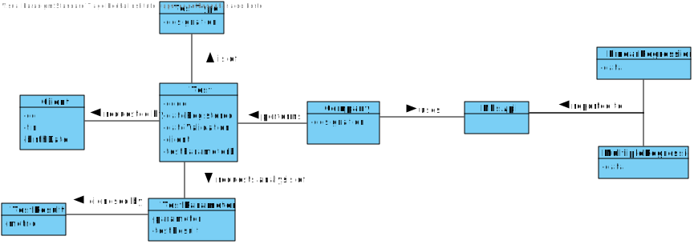

# US 19 - Send daily Covid-19 report to NHS 

## 1. Requirements Engineering

### 1.1. User Story Description

* The Many Labs company wants to send to the NHS daily reports of Covid-19 data, including the number of observed values and estimated values.*

### 1.2. Customer Specifications and Clarifications 

**From the Specifications Document:**

Reports should be generated automatically with historical data and must be sent every day at 6:00 am, Including the number of observed values and estimated values. 
When the system is configured to use the simple linear regression model, the performance of each model should be used to select the best model (the one that uses the number of tests realized or the one that uses the mean age as independent variable). 
Simple linear and multilinear regression models can be used to compute the estimates and corresponding confidence intervals.
The best model will be used to make the estimated/expected values that will be send to NHS.

**From the client clarifications:**

Q: From the covid report example you gave us we can see that is missing two dates(16/05/2021 and 23/05/2021) in the predictions table. Is there any specific reason?
A: These days of the week are two Sundays and the laboratory does not work on Sundays.

Q: From the report example we got that the administrator defines the dates interval to fit the model. Which date should the application use to provide the report? Is it the registration date or results registration date?
A: The registration date should be considered. But only tests that have already been validated should be considered.

Q: Is the significance level, for example, defined in the configuration file?
A: Yes the user could be choose the significance level for hip t and confidence level for IC

### 1.3. Acceptance Criteria

* AC1: The report should include day and week (observed and estimated) values, the regression model used to estimate each value, R(SLR), R2 and R2 adjusted for SLR and MLR, hypothesis tests for regression coefficients significance model with Anova

* AC2: The interval of dates to fit the regression model and the number of historical points (number of days and number of weeks) must be defined through a configuration file.

* AC3: The system should send the report using the NHS API

### 1.4. Found out Dependencies

US15: To send daily reports to Nhs, Tests need to be validated.

US14, US12, US11, US10, US9, US8, US4, US3

### 1.5 Input and Output Data

**Output Data**

* Console/GUI:

- (in)success of operation/report sent

* File:

- Report data

### 1.6. System Sequence Diagram (SSD)

### 1.7 Other Relevant Remarks

## 2. OO Analysis

### 2.1. Relevant Domain Model Excerpt 

### 2.2. Other Remarks

## 3. Design - User Story Realization 

### 3.1. Rationale

**The rationale grounds on the SSD interactions and the identified input/output data.**

| Interaction ID | Question: Which class is responsible for... | Answer  | Justification (with patterns)  |
|:-------------  |:--------------------- |:------------|:---------------------------- |
| Step 1  : sending daily report	 |	...generating automatically daily report?  |    Company        | IE: Company is responsible for running automatic timed tasks |
| Step 2  : imports data from file (initial date, final date, historic points, significance level)  |  ...knowing the file name ? |         ||
|Alternative(simples regression)|
---|
---|
---
| Step 3  : types requested data	 |		n/a  |             | |
| Step 4  : asks information (variable) |	n/a  |            ||
| Step 5  : types requested data	 |		...retrieves information - number of positives tests done for Date Range? |TestStore| IE: Knows all objects of Test
| Step 5  : types requested data	 |		...retrieves information - number of tests done for Date Range or number of mean age for Date Range? |TestStore -> ClientStore| IE: Knows all objects of Test and of Client
| Step 5  : types requested data	 |		...calculate linear regression?              |CovidReport ->LinearRegression| HC : To have less tasks associated with CovidReport and Specialization regarding the calculations requested.
|Alternative(Multilinear Regression)|
---|
---|
---
| Step 3  : types requested data	 |		...retrieves information - number of positives tests done for Date Range? |TestStore| IE: Knows all objects of Test
| Step 3  : types requested data	 |		...retrieves information - number of tests done for Date Range and number of mean age for Date Range? |TestStore -> ClientStore| IE: Knows all objects of Test and of Client
| Step 3  : types requested data	 |		...calculate multilinear regression?              |CovidReport ->MultilinearRegression| HC : To have less tasks associated with CovidReport and Specialization regarding the calculations requested.
| Step 6  : shows data and requests confirmation	 |	n/a	  |            ||
| Step 7  : confirms data	 |...show report?	  |      CovidReport      |IE|
| Step 7  : confirms data	 |...send info to NHS API?	  |    NHSAPI        ||
| Step 8  : sends info through NHS API and informs operation success|||

### Systematization ##

According to the taken rationale, the conceptual classes promoted to software classes are: 

* Administrator
* Company
* CovidReport
* NHSAPI
* Test

Other software classes (i.e. Pure Fabrication) identified: 
* CovidReportUI
* CovidReportController
* TestStore
* LinearRegression
* MultilinearRegression
* ClientStore

## 3.2. Sequence Diagram (SD)

####Main

#####List of Positives

#####List of Tests

#####List of Mean Age

## 3.3. Class Diagram (CD)

# 4. Tests 
*In this section, it is suggested to systematize how the tests were designed to allow a correct measurement of requirements fulfilling.* 

**_DO NOT COPY ALL DEVELOPED TESTS HERE_**

# 5. Construction (Implementation)

*It is also recommended organizing this content by subsections.* 

# 6. Integration and Demo 

# 7. Observations

